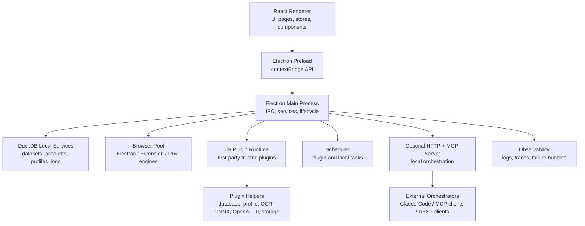

# Tianshe Client Open

[](LICENSE)
[](package.json)
[](https://www.electronjs.org/)
[](tsconfig.json)

Tianshe Client Open is the open-source desktop foundation for local data management, browser automation, and trusted first-party JavaScript plugin development.

It provides an Electron desktop shell, a DuckDB-backed local data layer, browser profile and browser-pool management, a JavaScript plugin runtime, local observability tools, and optional HTTP/MCP orchestration APIs for external automation clients.

> **Open edition boundary**
> This repository contains the upstream local client core. Cloud login, cloud snapshot, cloud catalog, private server integrations, and private deployment endpoints are intentionally absent or represented only by inert compatibility stubs.

---

## Table of Contents

- [Highlights](#highlights)
- [Architecture](#architecture)
- [Project Status](#project-status)
- [Requirements](#requirements)
- [Quick Start](#quick-start)
- [Development Workflow](#development-workflow)
- [Build and Package](#build-and-package)
- [Runtime Data](#runtime-data)
- [Shell Configuration](#shell-configuration)
- [Plugin Development](#plugin-development)
- [HTTP API and MCP Orchestration](#http-api-and-mcp-orchestration)
- [Security Model](#security-model)
- [Repository Structure](#repository-structure)
- [Available Scripts](#available-scripts)
- [Testing and Verification](#testing-and-verification)
- [Open Source Boundary](#open-source-boundary)
- [Troubleshooting](#troubleshooting)
- [Contributing](#contributing)
- [License](#license)

---

## Highlights

- **Local-first desktop client**: Electron main process, secure preload bridge, React renderer, and Windows-oriented packaging.
- **DuckDB data workspace**: dataset import/export, schema management, query templates, table folders, validation, record mutation, and local persistence.
- **Browser automation core**: browser profiles, account binding, proxy handling, fingerprint helpers, browser pool lifecycle, and multiple automation engines.
- **Trusted plugin runtime**: local JavaScript plugins with commands, UI contributions, plugin-owned tables, plugin storage, scheduled tasks, and helper namespaces.
- **Optional HTTP/MCP server**: local orchestration capabilities for browser automation, profiles, plugins, datasets, observations, and system health.
- **AI and automation helpers**: OCR pool, image similarity/search, ONNX runtime helpers, OpenAI-compatible helpers, FFI helpers, webhook callbacks, and task queues.
- **Observability**: structured logs, runtime traces, failure bundles, recent failure search, and startup diagnostics.
- **Open-source guardrails**: supply-chain verification, SBOM generation, open-edition boundary checks, ZIP extraction limits, IPC sender validation, and secret redaction utilities.

---

## Architecture



### Main layers

| Layer | Location | Responsibility |
| --- | --- | --- |
| Electron main process | `src/main/` | application lifecycle, IPC handlers, DuckDB services, browser pool integration, HTTP/MCP server, packaging runtime hooks |
| Preload bridge | `src/preload/` | typed renderer-facing API exposed through `contextBridge` |
| Renderer UI | `src/renderer/` | React application shell, datasets page, account center, plugin market, settings, stores and UI components |
| Core runtime | `src/core/` | browser automation, plugin runtime, query engine, observability, OCR/image/ONNX/FFI helpers, task queue |
| Shared contracts | `src/types/`, `src/shared/`, `src/constants/` | shared types, runtime configuration, HTTP API constants, shell configuration |
| Edition boundary | `src/edition/` | open-edition capability selection and cloud-feature stubs |
| Scripts | `scripts/` | development launch, build, packaging, CI verification, supply-chain and open-source boundary checks |

---

## Project Status

This project is an open-source client foundation. It is suitable for:

- local desktop data workflows;
- browser automation research and integration;
- internal first-party plugin development;
- local MCP/HTTP automation experiments;
- downstream private/cloud editions that depend on the open client core through a fixed release.

The open edition does **not** include private cloud services. Any cloud-facing code that remains in this repository must stay inert, local, and covered by open-source boundary checks.

---

## Requirements

- **Node.js 22 or newer**
- **npm**
- **Git**
- **Windows x64** for validated packaged desktop builds

macOS and Linux source development may work when Electron and native dependencies are available, but packaged builds and native runtime bundles are currently validated for Windows x64.

This project uses several native dependencies, including DuckDB, ONNX Runtime, Sharp, Koffi, HNSW, OCR, and Electron native modules. When native modules fail to install or rebuild, make sure your platform has the required compiler/build tooling for Node native packages.

---

## Quick Start

```bash
git clone https://github.com/tianshe-ai/tianshe-client-open.git
cd tianshe-client-open
npm ci
npm run dev:open
```

`npm run dev:open` starts the renderer dev server, watches the Electron main process TypeScript build, and launches Electron after both sides are ready.

To build and launch Electron directly from the repository root:

```bash
npm run build:open
npx electron .
```

---

## Development Workflow

### Start the full desktop app

```bash
npm run dev:open
```

### Start individual development pieces

```bash
npm run dev:renderer
npm run dev:main
npm run dev:electron
```

Normally you should use `npm run dev:open`, because it coordinates the renderer, main-process build, and Electron launch for you.

### Use a separate user data directory

```bash
TIANSHEAI_USER_DATA_DIR="C:\\tmp\\tianshe-client-open-dev" npm run dev:open
```

Or pass the runtime flag directly:

```bash
npx electron . --airpa-user-data-dir="C:\\tmp\\tianshe-client-open-dev"
```

The `airpa` flag names are kept for legacy local compatibility. New user-facing documentation and package metadata should use the Tianshe naming.

---

## Build and Package

### Build source

```bash
npm run build:open
```

This runs the renderer build, main-process TypeScript build, and open-edition boundary checks.

### Package portable Windows x64 build

```bash
npm run package:open:portable
```

The portable build is written to:

```text
release-build/
```

### Package installer build

```bash
npm run package:open:win
```

### Package unpacked directory for smoke testing

```bash
npm run package:open:dir
```

Open packages use:

- executable name: `tiansheai-open`
- app id: `com.tiansheai.client.open`
- product name: `tiansheai-open`

This keeps open-edition runtime data, shortcuts, and installer identity separate from private/cloud packages.

---

## Runtime Data

The open edition uses an independent runtime identity and user data directory.

During development, `scripts/launch-electron.js` uses an open package user data directory by default. On Windows this is typically similar to:

```text
%APPDATA%\@tianshe\client-open
```

You can override this with:

```bash
TIANSHEAI_USER_DATA_DIR="C:\\path\\to\\user-data" npm run dev:open
```

or:

```bash
npx electron . --airpa-user-data-dir="C:\\path\\to\\user-data"
```

Startup diagnostics are written under the Electron user data directory, for example:

```text
startup-diagnostic.log
```

---

## Shell Configuration

Place `tianshe-shell.config.json` beside the packaged `.exe` to hide built-in shell pages without rebuilding. In development, the same file can be placed in the repository root.

```json
{
  "pages": {
    "datasets": true,
    "marketplace": true,
    "accountCenter": true,
    "settings": true
  }
}
```

To run a plugin-only shell, hide all controlled built-in pages:

```json
{
  "pages": {
    "datasets": false,
    "marketplace": false,
    "accountCenter": false,
    "settings": false
  }
}
```

When all controlled pages are hidden, the app opens the first enabled plugin that contributes an Activity Bar view.

Supported aliases include:

- `datasets`, `data`, `tables`
- `marketplace`, `pluginMarket`, `plugin_market`, `plugins`
- `accountCenter`, `account_center`, `accounts`
- `settings`

---

## Plugin Development

Tianshe Client Open supports local JavaScript plugins. Plugin examples live in:

```text
examples/minimal-plugin/
```

A minimal plugin looks like this:

```json
{
  "id": "minimal-plugin",
  "name": "Minimal Plugin",
  "version": "1.0.0",
  "author": "tiansheai",
  "description": "A minimal local plugin example for Tianshe Client Open.",
  "main": "index.js",
  "trustModel": "first_party",
  "permissions": ["database", "ui"]
}
```

```js
module.exports = {
  async activate(context) {
    context.helpers.ui.info('Minimal plugin activated');
  },
};
```

### Plugin discovery

External plugins can be placed in either `plugins/` or `js-plugins/` beside the packaged executable. In development, the same layouts are also checked from the project root.

Supported layouts:

```text
plugins/my-plugin/manifest.json
plugins/my-plugin/index.js

js-plugins/my-plugin/manifest.json
js-plugins/my-plugin/index.js

plugins/my-plugin.tsai
plugins/my-plugin.zip
```

### Plugin trust model

Plugins are treated as trusted first-party host application code. They are **not** sandboxed third-party extensions.

Production plugin manifests must declare:

```json
{
  "trustModel": "first_party"
}
```

Do not install unreviewed third-party plugin packages. A third-party plugin ecosystem would require a separate isolation, signing, and capability model before those plugins can be safely supported.

### Plugin helper namespaces

The plugin runtime exposes helper namespaces documented in `docs/plugin-helpers-reference.md`, including:

- `helpers.account`
- `helpers.advanced`
- `helpers.button`
- `helpers.cloud` open-edition compatibility stub
- `helpers.customField` open-edition compatibility stub
- `helpers.cv`
- `helpers.database`
- `helpers.ffi`
- `helpers.image`
- `helpers.imageSearch`
- `helpers.network`
- `helpers.ocr`
- `helpers.onnx`
- `helpers.openai`
- `helpers.plugin`
- `helpers.profile`
- `helpers.raw`
- `helpers.savedSite`
- `helpers.scheduler`
- `helpers.storage`
- `helpers.taskQueue`
- `helpers.ui`
- `helpers.utils`
- `helpers.vectorIndex`
- `helpers.webhook`
- `helpers.window`

Plugin-facing types are available in:

```text
src/types/js-plugin.d.ts
```

Runtime implementations live under:

```text
src/core/js-plugin/
```

---

## HTTP API and MCP Orchestration

Tianshe Client Open includes an optional local HTTP server that can expose:

- health and runtime metrics;
- REST orchestration API;
- MCP endpoint for compatible clients;
- browser automation capabilities;
- profile, plugin, dataset, observation, and system capabilities.

The HTTP server is disabled by default.

### Enable from the desktop UI

Open:

```text
Settings -> HTTP API
```

Then enable the HTTP API and, if needed, the MCP endpoint.

### Enable from command line

```bash
npm run build:open
npx electron . --airpa-enable-http --airpa-enable-mcp --airpa-http-port=39090
```

Default local bind address and port:

```text
http://127.0.0.1:39090
```

Important routes include:

```text
GET  /health
GET  /api/v1/orchestration/capabilities
GET  /api/v1/orchestration/metrics
POST /api/v1/orchestration/sessions
POST /api/v1/orchestration/invoke
DELETE /api/v1/orchestration/sessions/:sessionId
POST /mcp
```

### Public orchestration capabilities

The public capability surface includes:

| Area | Capabilities |
| --- | --- |
| Session | `session_prepare`, `session_get_current`, `session_end_current` |
| Browser | `browser_observe`, `browser_snapshot`, `browser_search`, `browser_act`, `browser_wait_for`, `browser_debug_state` |
| Profile | `profile_list`, `profile_resolve`, `profile_create`, `profile_update`, `profile_delete` |
| Dataset | `dataset_create_empty`, `dataset_import_file`, `dataset_rename`, `dataset_delete` |
| Plugin | `plugin_list`, `plugin_install`, `plugin_reload`, `plugin_get_runtime_status`, `plugin_uninstall` |
| Observation | `observation_get_trace_summary`, `observation_get_failure_bundle`, `observation_get_trace_timeline`, `observation_search_recent_failures` |
| System | `system_bootstrap`, `system_get_health` |

### Authentication

HTTP token authentication can be configured from the Settings page. When enabled, callers must send:

```http
Authorization: Bearer <token>
```

`/health` is intentionally available for health checks. MCP authentication behavior is controlled by the HTTP API configuration.

---

## Security Model

This repository includes several security-oriented guardrails:

- **First-party-only plugin trust model**: plugins are host-code extensions, not third-party sandboxed code.
- **IPC sender validation**: privileged IPC handlers can verify that calls originate from the primary renderer window.
- **ZIP package safety**: plugin archives are checked for path traversal, entry limits, total uncompressed size, per-entry size, and unsafe compression ratios.
- **Sensitive value redaction**: tokens, cookies, API keys, passwords, secrets, credentials, and session-like fields are redacted before logs or diagnostic objects are shared.
- **HTTP token auth support**: optional Bearer token authentication for local HTTP orchestration routes.
- **Open-source boundary checks**: scripts prevent accidental inclusion of private cloud paths, private server markers, or generated build output in source packages.
- **Supply-chain policy**: dependency resolution hosts and reviewed exceptions are checked by script.

Security policy details are in:

```text
SECURITY.md
```

---

## Repository Structure

```text
.
├── assets/                         # application icons and desktop assets
├── build/                          # electron-builder resources and installer scripts
├── docs/                           # open-edition documentation
├── examples/
│   └── minimal-plugin/             # minimal first-party plugin example
├── scripts/                        # build, launch, package, verification, SBOM scripts
├── src/
│   ├── constants/                  # runtime, HTTP, browser-pool, OCR and UI constants
│   ├── core/                       # browser automation, plugin runtime, AI/dev, OCR, ONNX, FFI, observability
│   ├── edition/                    # open/cloud edition selection boundary
│   ├── main/                       # Electron main process, IPC, DuckDB services, HTTP/MCP server
│   ├── preload/                    # secure renderer bridge
│   ├── renderer/                   # React renderer app
│   ├── shared/                     # shared app-shell configuration contracts
│   ├── types/                      # shared TypeScript contracts
│   └── utils/                      # shared utility modules
├── electron-builder.yml            # desktop packaging configuration
├── package.json                    # scripts, dependencies, package metadata
├── tsconfig.json                   # shared TypeScript config
├── tsconfig.main.json              # main-process TypeScript config
├── vite.config.ts                  # renderer build config
└── vitest.config.ts                # test config
```

---

## Available Scripts

| Script | Purpose |
| --- | --- |
| `npm run dev` | Alias for `npm run dev:open` |
| `npm run dev:open` | Run the open edition development app |
| `npm run dev:renderer` | Start Vite renderer dev server |
| `npm run dev:main` | Watch-build Electron main/preload TypeScript |
| `npm run dev:electron` | Launch Electron against built main and renderer dev server |
| `npm run build` | Build renderer and main process |
| `npm run build:open` | Build open edition and verify open-source boundary |
| `npm run build:renderer` | Build React renderer into `dist/renderer` |
| `npm run build:main` | Build main/preload/core TypeScript into `dist` |
| `npm run package:open` | Alias for portable open package |
| `npm run package:open:portable` | Build portable Windows x64 package |
| `npm run package:open:win` | Build Windows installer and portable targets |
| `npm run package:open:dir` | Build unpacked app directory for smoke testing |
| `npm run test` | Alias for open-edition tests |
| `npm run test:open` | Run focused open-edition tests |
| `npm run test:open:full` | Run full open-edition Vitest suite |
| `npm run typecheck` | Type-check TypeScript without emitting files |
| `npm run lint` | Run ESLint |
| `npm run format:check` | Check Prettier formatting for source files |
| `npm run verify:supply-chain` | Verify dependency resolution and supply-chain policy |
| `npm run verify:open-source-boundary` | Verify open-edition file and literal boundary |
| `npm run sbom` | Generate SBOM output |
| `npm run verify:ci` | Run the full verification pipeline expected by CI |

---

## Testing and Verification

Before opening a pull request, run:

```bash
npm run typecheck
npm run lint
npm run test:open:full
npm run verify:supply-chain
npm run verify:open-source-boundary
npm run sbom
npm run build:open
```

Or run the combined CI verification command:

```bash
npm run verify:ci
```

Focused open-edition tests:

```bash
npm run test:open
```

Full test suite:

```bash
npm run test:open:full
```

---

## Open Source Boundary

The open edition may include a small allowlist of cloud compatibility stubs so shared UI and type contracts can compile. These stubs must not contain:

- real cloud endpoints;
- private server paths;
- private deployment hostnames;
- real auth/session flows;
- cloud snapshot/catalog implementations;
- private admin routes.

Run this before publishing or packaging source exports:

```bash
npm run verify:open-source-boundary
```

The boundary is defined by:

```text
scripts/open-source-manifest.json
scripts/open-source-boundary.js
```

The generic sync gateway in `src/main/sync/sync-gateway.ts` is an open protocol contract, not a private cloud implementation. Its limits are documented in:

```text
docs/open-sync-contract.md
```

---

## Troubleshooting

### `Missing Electron main build at dist/main/index.js`

Build the main process before launching Electron directly:

```bash
npm run build:open
npx electron .
```

### Development app does not launch

Use the coordinated dev command first:

```bash
npm run dev:open
```

If it still fails, check the startup diagnostic log under the Electron user data directory.

### Port `39090` is already in use

Use another local port:

```bash
npx electron . --airpa-enable-http --airpa-enable-mcp --airpa-http-port=39091
```

### Plugin import fails with trust-model error

Add the first-party trust declaration to `manifest.json`:

```json
{
  "trustModel": "first_party"
}
```

Only do this after the plugin has been reviewed as trusted first-party code.

### Plugin archive import fails

Check that the archive contains either:

```text
manifest.json
```

at the archive root, or a single nested directory containing `manifest.json`. Also ensure the package does not exceed ZIP safety limits.

### Native dependency installation fails

Make sure you are using Node.js 22 and have platform build tools available for native Node modules. Deleting `node_modules` and reinstalling with `npm ci` is often the cleanest reset.

### Packaged app starts with a blank window

Check:

- `startup-diagnostic.log` under the user data directory;
- whether `dist/main` and `dist/renderer` were produced by `npm run build:open`;
- whether native modules required by Electron were packaged and unpacked correctly.

---

## Contributing

Contributions are welcome when they preserve the open-edition boundary and first-party plugin trust model.

Before opening a pull request:

```bash
npm run verify:ci
```

Contribution rules:

- Fix core desktop, local data, browser automation, and plugin runtime issues in the open repository first.
- Keep cloud auth, cloud snapshot, cloud catalog, private ACL, and private server behavior outside this repository.
- Do not add private endpoints, private deployment hostnames, or private server imports.
- Do not add third-party plugin execution paths without a dedicated isolation, signing, and capability design.
- Update docs and tests when changing public APIs, plugin helpers, runtime flags, or packaging behavior.

See also:

```text
CONTRIBUTING.md
SECURITY.md
CHANGELOG.md
```

---

## Release Discipline

Open releases should use SemVer.

Private/cloud editions should consume this open client through a fixed version, tag, or tarball. Avoid floating dependency ranges for production private/cloud releases.

Recommended release flow:

1. Land core client changes in this open repository.
2. Run `npm run verify:ci`.
3. Tag or publish the open version.
4. Update downstream private/cloud editions to the exact open version.
5. Run downstream private/cloud CI before release.

---

## License

This project is licensed under the MIT License. See [LICENSE](LICENSE) for details.
