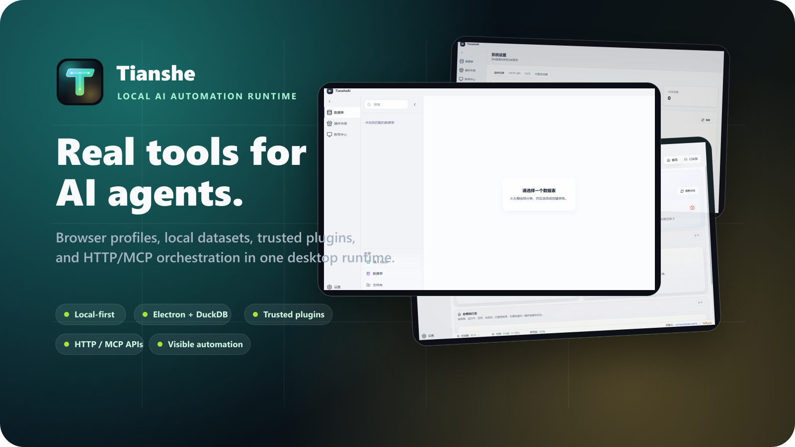
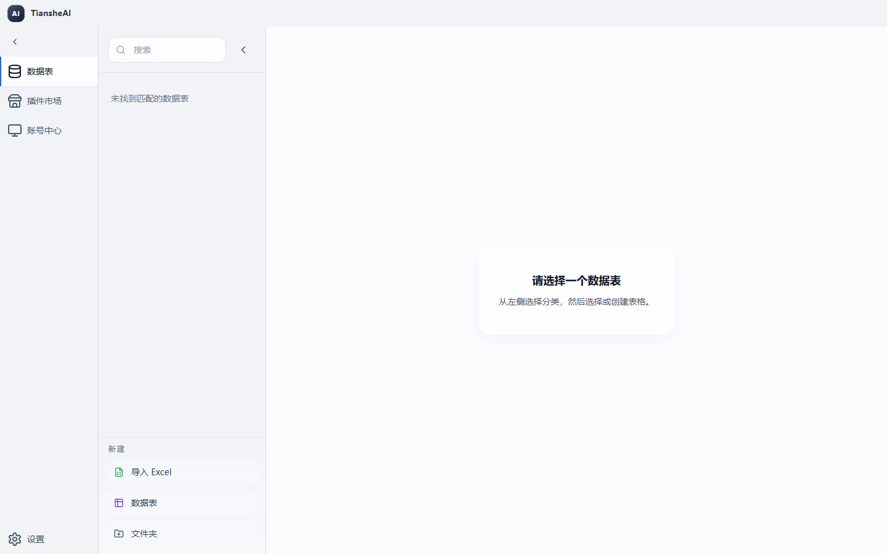
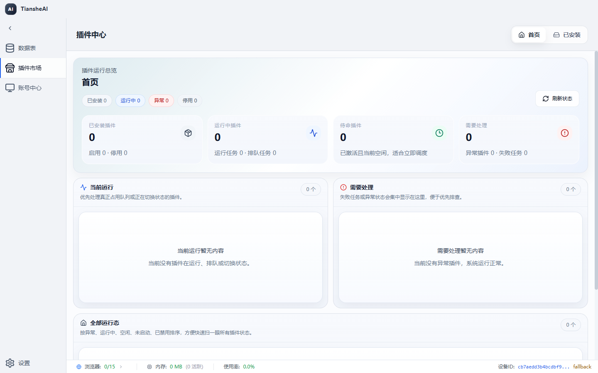
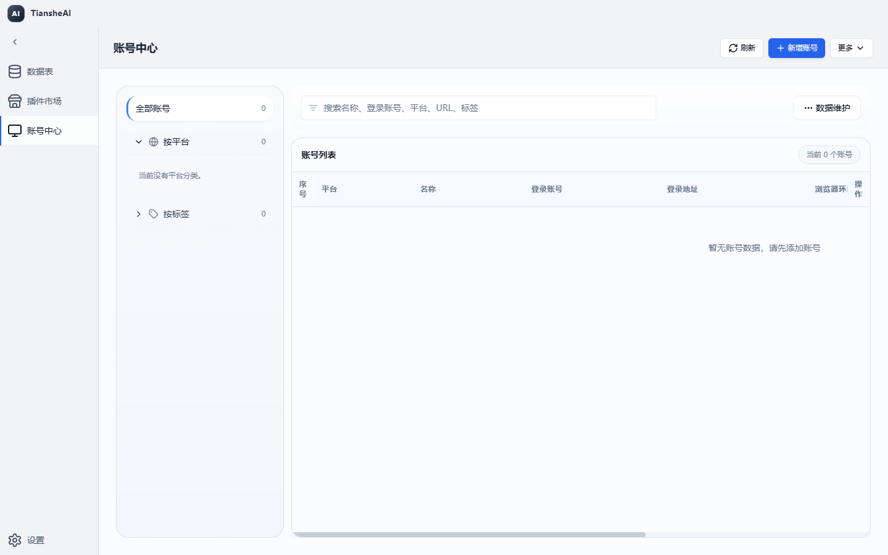
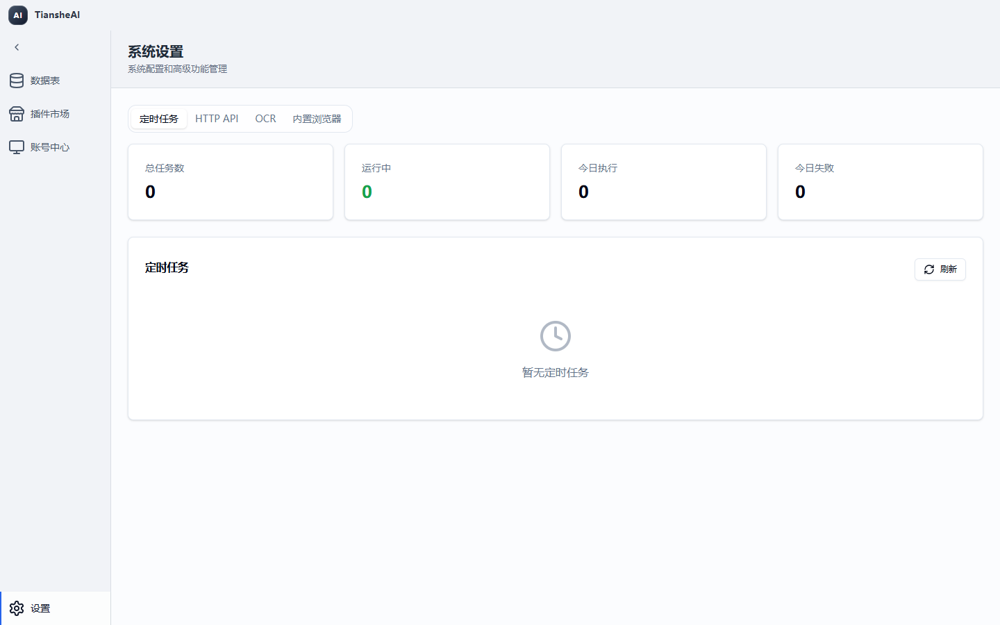
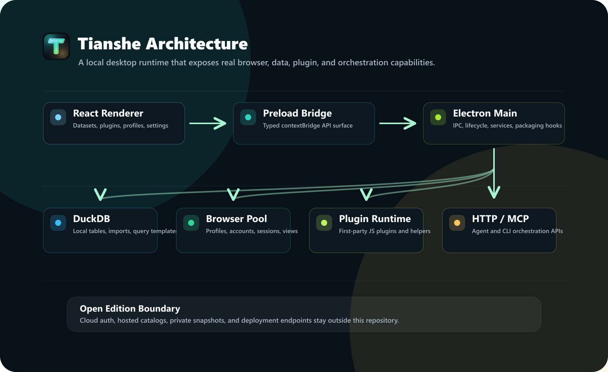

# Tianshe Client Open

[](LICENSE)
[](package.json)
[](https://www.electronjs.org/)
[](tsconfig.json)
[](https://github.com/haozing/tianshe/actions/workflows/ci.yml)

[English README](README.md)

Tianshe Client Open 是一个本地优先的桌面运行时，用于 AI 驱动的浏览器自动化、数据工作流，以及可信一方 JavaScript 插件开发。

它给 Agent 和开发者提供真实、可检查的工具：浏览器配置、本地数据集、插件自有存储、任务编排、可观测能力，以及 HTTP/MCP 自动化 API，同时把私有数据留在用户自己的机器上。

Tianshe 不是一个提示词外壳。它是面向真实工作流的桌面执行底座：可以操作真实浏览器、真实文件、真实本地表格和经过审查的产品插件，同时不把用户电脑变成无法解释的黑盒。

> **当前状态**
> 本仓库仍在积极开发中。第一个稳定版本之前，API 和插件契约仍可能调整。

> **开源版边界**
> 本仓库只包含开放的本地客户端核心。云登录、云快照、云插件目录、私有服务集成和私有部署端点不会放进开源版；如果代码里保留兼容入口，也必须是惰性桩实现，不能连接真实私有服务。

## 预览



| 数据工作台 | 插件运行时 |
| --- | --- |
|  |  |

| 账号中心 | 系统设置 |
| --- | --- |
|  |  |

---

## 理念

Tianshe 有几条很明确的产品判断：

- **本地状态应该是一等能力。** 数据表、浏览器配置、账号、日志、插件状态，都应该能在运行任务的机器上被看见和检查。
- **自动化不应该像黑盒魔法。** 浏览器动作、数据流、插件任务、错误和 trace 应该进入同一个工作台，让开发者知道到底发生了什么。
- **插件是产品代码，不是随便执行的第三方脚本。** 当前插件模型面向经过审查的一方可信扩展，用强能力换清晰边界。
- **AI Agent 需要真实工具，而不是只有提示词。** HTTP 和 MCP 暴露结构化能力，让模型、CLI 和外部编排器能操作浏览器、数据集、配置、插件和诊断信息。
- **开源核心必须干净。** 私有云能力应该在下游版本实现，开源仓库本身要能独立开发、测试、打包和发布。

如果你在构建内部自动化、数据清洗与富化、浏览器辅助运营、Agent 驱动工作流，Tianshe 可以作为这些系统下面的桌面底座。

---

## 可以用它构建什么

- 本地数据工作台：导入、查询、修改、导出和组织数据集。
- 浏览器自动化工作流：管理浏览器配置、账号绑定、代理、指纹和浏览器池。
- 一方可信插件：添加命令、页面、插件自有数据表、存储、定时任务和 helper 驱动的业务流程。
- 本地 HTTP/MCP 自动化端点：供 Agent、CLI 工具和编排客户端调用。
- 可调试的桌面自动化系统：结构化日志、trace、失败包、启动诊断和运行健康检查。
- 下游私有版或云版：通过固定版本消费开源客户端核心，同时把私有行为留在下游仓库。

---

## 项目亮点

- **Electron + React 桌面外壳**：主进程服务、类型化 preload 桥接和 Windows 打包。
- **DuckDB 本地数据层**：数据集、schema、查询模板、导入导出、记录变更、文件夹和元数据。
- **浏览器自动化核心**：浏览器配置、账号、平台、标签、浏览器池生命周期和多自动化引擎。
- **可信 JS 插件运行时**：支持本地一方插件，并提供 database、UI、OCR、ONNX、OpenAI 兼容调用、profile、storage、scheduler、webhook 等 helper。
- **可选 HTTP/MCP 服务**：向自动化客户端暴露结构化本地能力。
- **可观测能力**：结构化日志、trace、近期失败搜索、失败包和启动诊断。
- **工程护栏**：开源边界检查、供应链验证、SBOM、ZIP 安全限制、IPC 调用方校验和敏感信息脱敏。

---

## 架构



```text
React Renderer
  - 数据表、插件市场、账号中心、设置
  - Zustand 状态和 UI 组件
        |
        v
Electron Preload
  - contextBridge API
  - 感知 edition 的公开 API surface
        |
        v
Electron Main Process
  - IPC、应用生命周期、窗口、更新器钩子
  - DuckDB 服务、浏览器池、插件运行时
  - HTTP/MCP 服务、调度器、可观测能力
        |
        +--> DuckDB 本地数据和元数据
        +--> 浏览器引擎：electron / extension / ruyi
        +--> 一方可信 JavaScript 插件
        +--> 本地 REST 和 MCP 编排客户端
```

| 分层 | 位置 | 职责 |
| --- | --- | --- |
| 主进程 | `src/main/` | Electron 生命周期、IPC、DuckDB 服务、浏览器池集成、HTTP/MCP 服务、打包运行时钩子 |
| Preload 桥接 | `src/preload/` | 通过 `contextBridge` 暴露类型化 renderer API |
| 渲染层 UI | `src/renderer/` | 数据表、插件市场、账号中心、设置、应用外壳、状态管理和组件 |
| 核心运行时 | `src/core/` | 浏览器自动化、JS 插件运行时、查询引擎、OCR/图像/ONNX/FFI helper、可观测能力、任务队列 |
| Edition 边界 | `src/edition/` | 开源版能力选择和下游版本扩展点 |
| 共享契约 | `src/types/`, `src/shared/`, `src/constants/` | 类型、运行时配置、HTTP 常量、外壳配置、公开契约 |
| 工具脚本 | `scripts/` | 开发启动、构建、打包、测试、供应链检查、SBOM、开源边界验证 |

---

## 环境要求

- Node.js **22 或更高版本**
- npm
- Git
- Windows x64，用于已验证的桌面打包构建

如果 Electron 和原生依赖可用，macOS 和 Linux 可以尝试源码开发；但当前经过验证的打包运行时主要面向 Windows x64。

项目使用多个原生依赖，包括 DuckDB、ONNX Runtime、Sharp、Koffi、HNSW、OCR 和 Electron 原生模块。安装失败时，请先确认 Node 版本和本机原生构建工具链。

---

## 快速开始

```bash
git clone https://github.com/haozing/tianshe.git
cd tianshe
npm ci
npm run dev
```

`npm run dev` 是 `npm run dev:open` 的别名。它会启动 Vite 渲染层服务，监听 Electron 主进程构建，打包 preload 入口，写入主进程构建戳，并在全部就绪后启动 Electron。

也可以先构建再直接启动：

```bash
npm run build:open
npx electron .
```

---

## 开发

### 常用命令

```bash
npm run dev
npm run dev:open
npm run dev:renderer
npm run dev:main
npm run dev:electron
```

日常开发建议使用 `npm run dev`。拆分命令更适合单独调试某一层。

### 隔离用户数据目录

测试时建议使用独立的 Electron userData：

```powershell
$env:TIANSHEAI_USER_DATA_DIR="C:\tmp\tianshe-dev"
npm run dev
```

也可以直接传运行时参数：

```bash
npx electron . --airpa-user-data-dir="C:\tmp\tianshe-dev"
```

`airpa` 参数名是为了兼容历史本地运行方式。新的产品文案和包信息应优先使用 Tianshe 命名。

### 开发时启用 HTTP 和 MCP

```powershell
$env:AIRPA_ENABLE_HTTP="true"
$env:AIRPA_ENABLE_MCP="true"
$env:AIRPA_HTTP_PORT="39090"
npm run dev
```

真实 Electron UI 自动化测试可以通过 `AIRPA_E2E_CDP_PORT` 打开 Chrome DevTools Protocol 端口：

```powershell
$env:AIRPA_E2E_CDP_PORT="49333"
npm run dev
```

---

## 构建与打包

```bash
npm run build:open
npm run package:open:dir
npm run package:open:portable
npm run package:open:win
```

| 命令 | 输出 |
| --- | --- |
| `npm run build:open` | 构建 renderer 和 main/preload，并验证开源边界 |
| `npm run package:open:dir` | 构建未压缩应用目录，适合冒烟测试 |
| `npm run package:open:portable` | 构建 Windows x64 便携包 |
| `npm run package:open:win` | 构建 Windows 打包目标 |

开源版包信息：

- 可执行文件名：`tiansheai-open`
- app id：`com.tiansheai.client.open`
- 产品名：`tiansheai-open`

这些信息用于把开源版的用户数据、快捷方式和安装器身份与下游私有版/云版隔离。

---

## 运行时数据

开源版使用独立的运行时身份和用户数据目录。开发阶段，`scripts/launch-electron.js` 会为开源包解析 userData。Windows 上通常类似：

```text
%APPDATA%\@tianshe\client-open
```

可以通过环境变量覆盖：

```powershell
$env:TIANSHEAI_USER_DATA_DIR="C:\path\to\user-data"
npm run dev
```

启动诊断日志会写到 Electron userData 目录，例如：

```text
startup-diagnostic.log
```

---

## 外壳页面配置

将 `tianshe-shell.config.json` 放在打包后可执行文件同级目录，可以在不重新构建的情况下隐藏内置页面。开发阶段也可以放在仓库根目录。

```json
{
  "pages": {
    "datasets": true,
    "marketplace": true,
    "accountCenter": true,
    "settings": true
  }
}
```

如果要运行只包含插件页面的外壳，可以隐藏所有受控内置页面：

```json
{
  "pages": {
    "datasets": false,
    "marketplace": false,
    "accountCenter": false,
    "settings": false
  }
}
```

当所有受控内置页面都被隐藏时，应用会打开第一个贡献 Activity Bar 视图的已启用插件。

支持的别名包括：

- `datasets`, `data`, `tables`
- `marketplace`, `pluginMarket`, `plugin_market`, `plugins`
- `accountCenter`, `account_center`, `accounts`
- `settings`

---

## 插件开发

Tianshe Client Open 支持本地 JavaScript 插件。最小示例位于：

```text
examples/minimal-plugin/
```

最小 manifest：

```json
{
  "id": "minimal_plugin",
  "name": "Minimal Plugin",
  "version": "1.0.0",
  "author": "tiansheai",
  "description": "A minimal local plugin example for Tianshe Client Open.",
  "main": "index.js",
  "trustModel": "first_party",
  "permissions": ["database", "ui"]
}
```

最小入口：

```js
module.exports = {
  async activate(context) {
    context.helpers.ui.info('Minimal plugin activated');
  },
};
```

### 插件发现

外部插件可以放在打包后可执行文件同级的 `plugins/` 或 `js-plugins/` 目录。开发阶段也会检查项目根目录下的同名结构。

```text
plugins/my-plugin/manifest.json
plugins/my-plugin/index.js

js-plugins/my-plugin/manifest.json
js-plugins/my-plugin/index.js

plugins/my-plugin.tsai
plugins/my-plugin.zip
```

### 插件信任模型

插件被视为一方可信宿主代码。它们**不是**沙箱化的第三方扩展。

生产插件 manifest 必须声明：

```json
{
  "trustModel": "first_party"
}
```

不要安装未经审查的第三方插件包。如果未来要支持第三方插件生态，需要先设计独立的隔离、签名和能力授权模型。

### 插件 helper

插件 helper 命名空间文档见：

```text
docs/plugin-helpers-reference.md
```

代表性命名空间包括：

```text
helpers.account
helpers.database
helpers.ocr
helpers.onnx
helpers.openai
helpers.profile
helpers.savedSite
helpers.scheduler
helpers.storage
helpers.taskQueue
helpers.ui
helpers.webhook
helpers.window
```

插件侧类型定义：

```text
src/types/js-plugin.d.ts
```

运行时实现：

```text
src/core/js-plugin/
```

---

## HTTP API 与 MCP 编排

可选本地 HTTP 服务可以暴露健康检查、REST 编排 API 和兼容客户端使用的 MCP 端点。

从桌面 UI 启用：

```text
设置 -> HTTP API
```

或从命令行启用：

```bash
npm run build:open
npx electron . --airpa-enable-http --airpa-enable-mcp --airpa-http-port=39090
```

默认本地地址：

```text
http://127.0.0.1:39090
```

重要路由：

```text
GET    /health
GET    /api/v1/orchestration/capabilities
GET    /api/v1/orchestration/metrics
POST   /api/v1/orchestration/sessions
POST   /api/v1/orchestration/invoke
DELETE /api/v1/orchestration/sessions/:sessionId
POST   /mcp
DELETE /mcp
```

代表性公开能力：

| 领域 | 能力 |
| --- | --- |
| 会话 | `session_list`, `session_prepare`, `session_get_current`, `session_close`, `session_end_current`, `session_close_profile` |
| 浏览器 | `browser_observe`, `browser_snapshot`, `browser_search`, `browser_wait_for`, `browser_act`, `browser_debug_state` |
| 配置 | `profile_list`, `profile_get`, `profile_resolve`, `profile_start_session`, `profile_create`, `profile_update`, `profile_delete` |
| 数据集 | `dataset_list`, `dataset_get_info`, `dataset_query`, `dataset_import_file`, `dataset_create_empty`, `dataset_rename`, `dataset_delete` |
| 插件 | `plugin_list`, `plugin_get_runtime_status`, `plugin_install`, `plugin_reload`, `plugin_uninstall` |
| 观测 | `observation_get_trace_summary`, `observation_get_failure_bundle`, `observation_get_trace_timeline`, `observation_search_recent_failures` |
| 系统 | `system_bootstrap`, `system_get_health` |

HTTP Token 认证可以在设置页配置。启用后，调用方需要发送：

```http
Authorization: Bearer <token>
```

`/health` 会刻意保持可访问，用于健康检查。

---

## 安全模型

- **一方可信插件模型**：插件是强能力、经过审查的宿主代码扩展。
- **开源版能力面**：云能力在 `src/edition/open` 中关闭。
- **Preload 隔离**：渲染层只能通过类型化 `contextBridge` surface 访问特权 API。
- **IPC 调用方校验**：特权 handler 可以校验调用是否来自可信渲染窗口。
- **ZIP 安全限制**：插件压缩包会检查路径穿越、条目数量、大小和异常压缩比。
- **敏感信息脱敏**：token、cookie、密码、API key、secret、credential 和类似会话字段会在日志和诊断对象中脱敏。
- **HTTP 认证支持**：本地编排路由可以要求 Bearer Token。
- **开源边界检查**：脚本会阻止私有云路径、私有服务标记、生成产物或私有部署细节误入仓库。
- **供应链检查**：依赖来源策略和已审查例外会通过脚本验证。

详见：

```text
SECURITY.md
```

---

## 开源版边界

开源版允许保留少量兼容桩，以便共享 UI 和类型契约可以正常编译。但这些桩不得包含：

- 真实云端点；
- 私有服务路径；
- 私有部署主机名；
- 真实云认证或会话流程；
- 云快照或云目录实现；
- 私有管理路由。

运行：

```bash
npm run verify:open-source-boundary
```

边界规则位于：

```text
scripts/open-source-manifest.json
scripts/open-source-boundary.js
```

`src/main/sync/sync-gateway.ts` 中的通用同步网关是开放协议契约，不是私有云实现。详见：

```text
docs/open-sync-contract.md
```

---

## 仓库结构

```text
.
|-- assets/                 桌面资源
|-- build/                  electron-builder 资源
|-- docs/                   开源版文档
|-- examples/
|   `-- minimal-plugin/     最小一方可信插件示例
|-- scripts/                构建、启动、打包、验证、SBOM
|-- src/
|   |-- constants/          运行时和共享常量
|   |-- core/               自动化、插件运行时、AI/dev、OCR、ONNX、FFI、可观测能力
|   |-- edition/            开源版和下游版本边界
|   |-- main/               Electron 主进程、IPC、DuckDB、HTTP/MCP
|   |-- preload/            安全渲染桥接
|   |-- renderer/           React 渲染层应用
|   |-- shared/             共享外壳配置契约
|   |-- types/              TypeScript 契约
|   `-- utils/              共享工具
|-- electron-builder.yml
|-- package.json
|-- tsconfig.json
|-- tsconfig.main.json
|-- vite.config.ts
`-- vitest.config.ts
```

---

## 可用脚本

| 脚本 | 用途 |
| --- | --- |
| `npm run dev` | `npm run dev:open` 的别名 |
| `npm run dev:open` | 启动开源版开发应用 |
| `npm run dev:renderer` | 启动 Vite 渲染层开发服务 |
| `npm run dev:main` | 监听构建 Electron main/preload TypeScript |
| `npm run dev:electron` | 基于已构建主进程和渲染层开发服务启动 Electron |
| `npm run build` | 构建 renderer 和 main |
| `npm run build:open` | 构建开源版并验证开源边界 |
| `npm run package:open` | 开源便携包别名 |
| `npm run package:open:dir` | 构建未压缩应用目录，适合冒烟测试 |
| `npm run package:open:portable` | 构建 Windows x64 便携包 |
| `npm run package:open:win` | 构建 Windows 打包目标 |
| `npm run test` | 开源版测试别名 |
| `npm run test:open` | 运行开源版重点测试 |
| `npm run test:open:full` | 运行完整开源版 Vitest 测试 |
| `npm run test:architecture` | 运行架构护栏测试 |
| `npm run test:main-bootstrap` | 运行主进程 runtime/bootstrap 重点测试 |
| `npm run test:browser-pool` | 运行浏览器池重点测试 |
| `npm run test:dataset-ipc` | 运行数据集 IPC 和 store 测试 |
| `npm run typecheck` | TypeScript 类型检查，不输出文件 |
| `npm run lint` | 运行 ESLint |
| `npm run format:check` | 检查 Prettier 格式 |
| `npm run verify:supply-chain` | 验证依赖来源策略 |
| `npm run verify:open-source-boundary` | 验证开源版边界 |
| `npm run sbom` | 生成 SBOM |
| `npm run verify:ci` | 运行完整 CI 验证流水线 |

---

## 测试与验证

重点检查：

```bash
npm run typecheck
npm run test:open
npm run verify:open-source-boundary
```

完整开源测试：

```bash
npm run test:open:full
```

完整 CI 风格验证：

```bash
npm run verify:ci
```

真实桌面冒烟测试：

```bash
npm run build:open
npm run package:open:dir
```

然后从 `release-build/` 启动未压缩应用。

---

## 常见问题

### `Missing Electron main build at dist/main/index.js`

先构建：

```bash
npm run build:open
npx electron .
```

### 开发应用无法启动

优先使用统一命令：

```bash
npm run dev
```

然后检查 Electron userData 目录下的 `startup-diagnostic.log`。

### 端口 `39090` 被占用

换一个端口：

```bash
npx electron . --airpa-enable-http --airpa-enable-mcp --airpa-http-port=39091
```

### 插件安装时报 trust model 错误

只有在插件已经作为可信一方代码审查通过后，才添加：

```json
{
  "trustModel": "first_party"
}
```

### 插件压缩包导入失败

确认压缩包根目录包含 `manifest.json`，或者压缩包内只有一个子目录且该目录包含 `manifest.json`；同时确认压缩包没有超过 ZIP 安全限制。

### 原生依赖安装失败

请使用 Node.js 22，并安装当前平台所需的原生 Node 模块构建工具。通常可以删除 `node_modules` 后重新执行 `npm ci`。

### 打包应用打开后是空白窗口

检查：

- `startup-diagnostic.log`；
- 是否已经通过 `npm run build:open` 生成 `dist/main` 和 `dist/renderer`；
- Electron 所需原生模块是否被正确打包和解包。

---

## 贡献

欢迎贡献，但所有改动都必须保持开源版边界和一方可信插件模型。

提交 Pull Request 前：

```bash
npm run verify:ci
```

贡献规则：

- 核心桌面、本地数据、浏览器自动化和插件运行时问题，优先在本开源仓库修复。
- 云认证、云快照、云目录、私有 ACL 和私有服务行为不得放入本仓库。
- 不要添加私有端点、私有部署主机名或私有服务导入。
- 不要在缺少独立隔离、签名和能力授权设计的情况下添加第三方插件执行路径。
- 修改公共 API、插件 helper、运行时参数或打包行为时，请同步更新文档和测试。

相关文档：

```text
ROADMAP.md
CONTRIBUTING.md
SECURITY.md
CHANGELOG.md
```

---

## 发布规范

开源版本建议使用 SemVer。

下游私有版/云版应通过固定版本、tag 或 tarball 消费本开源客户端。生产下游版本不建议使用浮动依赖范围。

推荐流程：

1. 在本开源仓库合入核心客户端变更。
2. 运行 `npm run verify:ci`。
3. 打 tag 或发布开源版本。
4. 将下游版本更新到精确的开源版本。
5. 运行下游 CI 后再发布。

---

## 许可证

本项目基于 MIT License 开源。详见 [LICENSE](LICENSE)。
