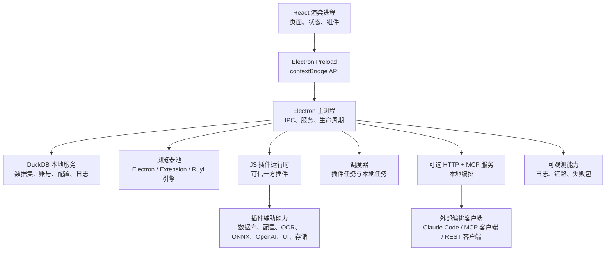

# Tianshe Client Open

[](LICENSE)
[](package.json)
[](https://www.electronjs.org/)
[](tsconfig.json)

Tianshe Client Open 是一个面向本地数据管理、浏览器自动化和可信一方 JavaScript 插件开发的开源桌面客户端基础工程。

项目提供了 Electron 桌面应用外壳、基于 DuckDB 的本地数据层、浏览器配置与浏览器池管理、JavaScript 插件运行时、本地可观测能力，以及可选的 HTTP / MCP 编排接口，方便外部自动化客户端进行本地协同。

> **开源版边界说明**  
> 本仓库只包含本地客户端核心能力。云登录、云快照、云插件目录、私有服务集成、私有部署端点等能力不会包含在开源版中；如代码中存在相关兼容入口，也应保持为惰性桩实现，不连接真实私有服务。

---

## 目录

- [项目亮点](#项目亮点)
- [整体架构](#整体架构)
- [项目状态](#项目状态)
- [环境要求](#环境要求)
- [快速开始](#快速开始)
- [开发流程](#开发流程)
- [构建与打包](#构建与打包)
- [运行时数据](#运行时数据)
- [外壳页面配置](#外壳页面配置)
- [插件开发](#插件开发)
- [HTTP API 与 MCP 编排](#http-api-与-mcp-编排)
- [安全模型](#安全模型)
- [项目结构](#项目结构)
- [可用脚本](#可用脚本)
- [测试与验证](#测试与验证)
- [开源版边界](#开源版边界)
- [常见问题](#常见问题)
- [贡献指南](#贡献指南)
- [发布规范](#发布规范)
- [许可证](#许可证)

---

## 项目亮点

- **本地优先的桌面客户端**：基于 Electron 主进程、安全 preload 桥接层、React 渲染进程和 Windows 打包流程构建。
- **DuckDB 本地数据工作区**：支持数据集导入导出、Schema 管理、查询模板、表分组、数据校验、记录变更和本地持久化。
- **浏览器自动化核心**：支持浏览器配置、账号绑定、代理处理、指纹辅助、浏览器池生命周期管理和多种自动化引擎接入。
- **可信插件运行时**：支持本地 JavaScript 插件、插件命令、UI 扩展、插件自有数据表、插件存储、定时任务和辅助命名空间。
- **可选 HTTP / MCP 服务**：可对外暴露本地编排能力，用于浏览器自动化、配置文件、插件、数据集、观测信息和系统健康检查。
- **AI 与自动化辅助能力**：包含 OCR 池、图像相似度与图像搜索、ONNX Runtime、OpenAI 兼容辅助、FFI 辅助、Webhook 回调和任务队列。
- **可观测性**：支持结构化日志、运行时链路、失败包、近期失败搜索和启动诊断。
- **开源安全护栏**：包含供应链验证、SBOM 生成、开源边界检查、ZIP 解压限制、IPC 调用方校验和敏感信息脱敏工具。

---

## 整体架构



### 主要分层

| 分层 | 位置 | 职责 |
| --- | --- | --- |
| Electron 主进程 | `src/main/` | 应用生命周期、IPC 处理、DuckDB 服务、浏览器池集成、HTTP / MCP 服务、打包运行时钩子 |
| Preload 桥接层 | `src/preload/` | 通过 `contextBridge` 向渲染进程暴露类型化 API |
| 渲染层 UI | `src/renderer/` | React 应用外壳、数据集页面、账号中心、插件市场、设置页、状态管理和 UI 组件 |
| 核心运行时 | `src/core/` | 浏览器自动化、插件运行时、查询引擎、可观测能力、OCR / 图像 / ONNX / FFI 辅助、任务队列 |
| 共享契约 | `src/types/`、`src/shared/`、`src/constants/` | 共享类型、运行时配置、HTTP API 常量、外壳配置 |
| 版本边界 | `src/edition/` | 开源版 / 云版能力选择边界与云能力桩实现 |
| 脚本工具 | `scripts/` | 开发启动、构建、打包、CI 验证、供应链检查、开源边界检查 |

---

## 项目状态

本项目是一个开源客户端基础工程，适合用于：

- 本地桌面数据工作流；
- 浏览器自动化研究与集成；
- 内部可信一方插件开发；
- 本地 MCP / HTTP 自动化实验；
- 下游私有版或云版基于固定开源版本进行二次封装。

开源版**不包含**私有云服务能力。任何仍保留在仓库中的云相关代码，都必须保持为本地惰性兼容实现，并通过开源边界检查。

---

## 环境要求

- **Node.js 22 或更高版本**
- **npm**
- **Git**
- **Windows x64**，用于已验证的桌面打包构建

macOS 和 Linux 在具备 Electron 与原生依赖构建环境时，可以尝试源码开发；但当前经过验证的安装包和原生运行时主要面向 Windows x64。

项目依赖多个原生模块，包括 DuckDB、ONNX Runtime、Sharp、Koffi、HNSW、OCR 和 Electron 原生模块等。如果安装或重建原生依赖失败，请确认本机已经安装对应平台所需的 Node 原生编译工具链。

---

## 快速开始

```bash
git clone https://github.com/tianshe-ai/tianshe-client-open.git
cd tianshe-client-open
npm ci
npm run dev:open
```

`npm run dev:open` 会启动渲染进程开发服务器，监听 Electron 主进程 TypeScript 构建，并在两侧都准备好后启动 Electron 应用。

如需从仓库根目录直接构建并启动 Electron：

```bash
npm run build:open
npx electron .
```

---

## 开发流程

### 启动完整桌面应用

```bash
npm run dev:open
```

### 分别启动开发组件

```bash
npm run dev:renderer
npm run dev:main
npm run dev:electron
```

通常建议使用 `npm run dev:open`，因为它会统一协调渲染进程、主进程构建和 Electron 启动流程。

### 使用独立用户数据目录

```bash
TIANSHEAI_USER_DATA_DIR="C:\\tmp\\tianshe-client-open-dev" npm run dev:open
```

也可以直接传入运行时参数：

```bash
npx electron . --airpa-user-data-dir="C:\\tmp\\tianshe-client-open-dev"
```

`airpa` 参数名是为兼容历史本地运行方式而保留。新的用户文档和包元信息应优先使用 Tianshe 命名。

---

## 构建与打包

### 构建源码

```bash
npm run build:open
```

该命令会执行渲染层构建、主进程 TypeScript 构建，并运行开源版边界检查。

### 打包 Windows x64 便携版

```bash
npm run package:open:portable
```

便携版产物默认输出到：

```text
release-build/
```

### 打包 Windows 安装包

```bash
npm run package:open:win
```

### 打包未压缩目录，用于冒烟测试

```bash
npm run package:open:dir
```

开源版包信息：

- 可执行文件名：`tiansheai-open`
- 应用 ID：`com.tiansheai.client.open`
- 产品名：`tiansheai-open`

这些信息用于将开源版的运行时数据、快捷方式和安装器身份与私有版 / 云版隔离。

---

## 运行时数据

开源版使用独立的运行时身份和用户数据目录。

开发阶段，`scripts/launch-electron.js` 默认使用开源包对应的用户数据目录。在 Windows 上通常类似：

```text
%APPDATA%\@tianshe\client-open
```

可以通过环境变量覆盖：

```bash
TIANSHEAI_USER_DATA_DIR="C:\\path\\to\\user-data" npm run dev:open
```

也可以通过 Electron 参数覆盖：

```bash
npx electron . --airpa-user-data-dir="C:\\path\\to\\user-data"
```

启动诊断日志会写入 Electron 用户数据目录，例如：

```text
startup-diagnostic.log
```

---

## 外壳页面配置

可以将 `tianshe-shell.config.json` 放在打包后的 `.exe` 同级目录，用于在不重新构建的情况下隐藏内置外壳页面。开发阶段也可以将该文件放在仓库根目录。

```json
{
  "pages": {
    "datasets": true,
    "marketplace": true,
    "accountCenter": true,
    "settings": true
  }
}
```

如果要运行一个仅包含插件页面的外壳，可以隐藏所有受控内置页面：

```json
{
  "pages": {
    "datasets": false,
    "marketplace": false,
    "accountCenter": false,
    "settings": false
  }
}
```

当所有受控内置页面都被隐藏时，应用会打开第一个贡献了 Activity Bar 视图的已启用插件。

支持的页面别名包括：

- `datasets`、`data`、`tables`
- `marketplace`、`pluginMarket`、`plugin_market`、`plugins`
- `accountCenter`、`account_center`、`accounts`
- `settings`

---

## 插件开发

Tianshe Client Open 支持本地 JavaScript 插件。插件示例位于：

```text
examples/minimal-plugin/
```

一个最小插件示例如下：

```json
{
  "id": "minimal-plugin",
  "name": "Minimal Plugin",
  "version": "1.0.0",
  "author": "tiansheai",
  "description": "A minimal local plugin example for Tianshe Client Open.",
  "main": "index.js",
  "trustModel": "first_party",
  "permissions": ["database", "ui"]
}
```

```js
module.exports = {
  async activate(context) {
    context.helpers.ui.info('Minimal plugin activated');
  },
};
```

### 插件发现规则

外部插件可以放在打包后可执行文件同级的 `plugins/` 或 `js-plugins/` 目录中。开发阶段，项目根目录下的相同目录结构也会被扫描。

支持以下布局：

```text
plugins/my-plugin/manifest.json
plugins/my-plugin/index.js

js-plugins/my-plugin/manifest.json
js-plugins/my-plugin/index.js

plugins/my-plugin.tsai
plugins/my-plugin.zip
```

### 插件信任模型

插件被视为可信一方宿主应用代码。它们**不是**沙箱化的第三方扩展。

生产插件的 `manifest.json` 必须声明：

```json
{
  "trustModel": "first_party"
}
```

不要安装未经审查的第三方插件包。若要支持第三方插件生态，需要先设计独立的隔离、签名和能力授权模型。

### 插件辅助命名空间

插件运行时会暴露多个辅助命名空间，详见 `docs/plugin-helpers-reference.md`，包括：

- `helpers.account`
- `helpers.advanced`
- `helpers.button`
- `helpers.cloud`，开源版兼容桩
- `helpers.customField`，开源版兼容桩
- `helpers.cv`
- `helpers.database`
- `helpers.ffi`
- `helpers.image`
- `helpers.imageSearch`
- `helpers.network`
- `helpers.ocr`
- `helpers.onnx`
- `helpers.openai`
- `helpers.plugin`
- `helpers.profile`
- `helpers.raw`
- `helpers.savedSite`
- `helpers.scheduler`
- `helpers.storage`
- `helpers.taskQueue`
- `helpers.ui`
- `helpers.utils`
- `helpers.vectorIndex`
- `helpers.webhook`
- `helpers.window`

插件侧类型定义位于：

```text
src/types/js-plugin.d.ts
```

运行时实现位于：

```text
src/core/js-plugin/
```

---

## HTTP API 与 MCP 编排

Tianshe Client Open 内置一个可选本地 HTTP 服务，可用于暴露：

- 健康检查与运行时指标；
- REST 编排 API；
- 兼容客户端使用的 MCP 端点；
- 浏览器自动化能力；
- 配置文件、插件、数据集、观测信息和系统能力。

HTTP 服务默认关闭。

### 从桌面 UI 启用

打开：

```text
Settings -> HTTP API
```

然后启用 HTTP API。如需 MCP，也可以一并启用 MCP 端点。

### 从命令行启用

```bash
npm run build:open
npx electron . --airpa-enable-http --airpa-enable-mcp --airpa-http-port=39090
```

默认本地绑定地址和端口：

```text
http://127.0.0.1:39090
```

重要路由包括：

```text
GET  /health
GET  /api/v1/orchestration/capabilities
GET  /api/v1/orchestration/metrics
POST /api/v1/orchestration/sessions
POST /api/v1/orchestration/invoke
DELETE /api/v1/orchestration/sessions/:sessionId
POST /mcp
```

### 公开编排能力

| 领域 | 能力 |
| --- | --- |
| 会话 | `session_prepare`、`session_get_current`、`session_end_current` |
| 浏览器 | `browser_observe`、`browser_snapshot`、`browser_search`、`browser_act`、`browser_wait_for`、`browser_debug_state` |
| 配置文件 | `profile_list`、`profile_resolve`、`profile_create`、`profile_update`、`profile_delete` |
| 数据集 | `dataset_create_empty`、`dataset_import_file`、`dataset_rename`、`dataset_delete` |
| 插件 | `plugin_list`、`plugin_install`、`plugin_reload`、`plugin_get_runtime_status`、`plugin_uninstall` |
| 观测 | `observation_get_trace_summary`、`observation_get_failure_bundle`、`observation_get_trace_timeline`、`observation_search_recent_failures` |
| 系统 | `system_bootstrap`、`system_get_health` |

### 认证

HTTP Token 认证可以在设置页配置。启用后，调用方需要携带：

```http
Authorization: Bearer <token>
```

`/health` 会刻意保持可访问，用于健康检查。MCP 的认证行为由 HTTP API 配置控制。

---

## 安全模型

本仓库包含多项安全防护：

- **仅一方可信插件模型**：插件是宿主代码扩展，不是第三方沙箱代码。
- **IPC 调用方校验**：特权 IPC 处理器可以校验调用是否来自主渲染窗口。
- **ZIP 包安全限制**：插件压缩包会检查路径穿越、条目数量、总解压大小、单文件大小和异常压缩比。
- **敏感信息脱敏**：Token、Cookie、API Key、密码、Secret、Credential 和类似会话字段在写入日志或诊断对象前会被脱敏。
- **HTTP Token 认证**：本地 HTTP 编排路由支持可选 Bearer Token 认证。
- **开源边界检查**：脚本会阻止私有云路径、私有服务标记或生成产物误入源码包。
- **供应链策略**：依赖解析地址和已审查例外会通过脚本检查。

安全策略详见：

```text
SECURITY.md
```

---

## 项目结构

```text
.
├── assets/                         # 应用图标和桌面资源
├── build/                          # electron-builder 资源和安装脚本
├── docs/                           # 开源版文档
├── examples/
│   └── minimal-plugin/             # 最小可信一方插件示例
├── scripts/                        # 构建、启动、打包、验证、SBOM 脚本
├── src/
│   ├── constants/                  # 运行时、HTTP、浏览器池、OCR 和 UI 常量
│   ├── core/                       # 浏览器自动化、插件运行时、AI/dev、OCR、ONNX、FFI、可观测能力
│   ├── edition/                    # 开源版 / 云版能力选择边界
│   ├── main/                       # Electron 主进程、IPC、DuckDB 服务、HTTP / MCP 服务
│   ├── preload/                    # 安全渲染桥接层
│   ├── renderer/                   # React 渲染层应用
│   ├── shared/                     # 共享应用外壳配置契约
│   ├── types/                      # 共享 TypeScript 契约
│   └── utils/                      # 共享工具模块
├── electron-builder.yml            # 桌面打包配置
├── package.json                    # 脚本、依赖和包元信息
├── tsconfig.json                   # 共享 TypeScript 配置
├── tsconfig.main.json              # 主进程 TypeScript 配置
├── vite.config.ts                  # 渲染层构建配置
└── vitest.config.ts                # 测试配置
```

---

## 可用脚本

| 脚本 | 用途 |
| --- | --- |
| `npm run dev` | `npm run dev:open` 的别名 |
| `npm run dev:open` | 启动开源版开发应用 |
| `npm run dev:renderer` | 启动 Vite 渲染进程开发服务器 |
| `npm run dev:main` | 监听构建 Electron 主进程 / preload TypeScript |
| `npm run dev:electron` | 基于已构建主进程和渲染进程开发服务器启动 Electron |
| `npm run build` | 构建渲染层和主进程 |
| `npm run build:open` | 构建开源版并验证开源边界 |
| `npm run build:renderer` | 将 React 渲染层构建到 `dist/renderer` |
| `npm run build:main` | 将主进程 / preload / core TypeScript 构建到 `dist` |
| `npm run package:open` | 开源便携版打包别名 |
| `npm run package:open:portable` | 构建 Windows x64 便携包 |
| `npm run package:open:win` | 构建 Windows 安装包和便携包 |
| `npm run package:open:dir` | 构建未压缩应用目录，用于冒烟测试 |
| `npm run test` | 开源版测试别名 |
| `npm run test:open` | 运行开源版重点测试 |
| `npm run test:open:full` | 运行完整开源版 Vitest 测试套件 |
| `npm run typecheck` | 仅执行 TypeScript 类型检查，不输出文件 |
| `npm run lint` | 运行 ESLint |
| `npm run format:check` | 检查源码是否符合 Prettier 格式 |
| `npm run verify:supply-chain` | 验证依赖解析和供应链策略 |
| `npm run verify:open-source-boundary` | 验证开源版文件和文本边界 |
| `npm run sbom` | 生成 SBOM |
| `npm run verify:ci` | 运行 CI 期望的完整验证流水线 |

---

## 测试与验证

提交 Pull Request 前，建议运行：

```bash
npm run typecheck
npm run lint
npm run test:open:full
npm run verify:supply-chain
npm run verify:open-source-boundary
npm run sbom
npm run build:open
```

也可以直接运行组合验证命令：

```bash
npm run verify:ci
```

运行开源版重点测试：

```bash
npm run test:open
```

运行完整测试套件：

```bash
npm run test:open:full
```

---

## 开源版边界

开源版允许保留少量云能力兼容桩，以便共享 UI 和类型契约可以正常编译。但这些桩实现不得包含：

- 真实云端点；
- 私有服务路径；
- 私有部署主机名；
- 真实认证 / 会话流程；
- 云快照 / 云目录实现；
- 私有管理路由。

发布或打包源码前，请运行：

```bash
npm run verify:open-source-boundary
```

边界规则定义在：

```text
scripts/open-source-manifest.json
scripts/open-source-boundary.js
```

`src/main/sync/sync-gateway.ts` 中的通用同步网关是开放协议契约，不是私有云实现。它的限制说明见：

```text
docs/open-sync-contract.md
```

---

## 常见问题

### `Missing Electron main build at dist/main/index.js`

直接启动 Electron 前，需要先构建主进程：

```bash
npm run build:open
npx electron .
```

### 开发应用无法启动

优先使用统一开发命令：

```bash
npm run dev:open
```

如果仍然失败，请检查 Electron 用户数据目录下的启动诊断日志。

### 端口 `39090` 已被占用

可以换一个本地端口：

```bash
npx electron . --airpa-enable-http --airpa-enable-mcp --airpa-http-port=39091
```

### 插件导入时报 trust model 错误

在 `manifest.json` 中添加一方可信声明：

```json
{
  "trustModel": "first_party"
}
```

只有在确认插件已经作为可信一方代码审查通过后，才应添加该声明。

### 插件压缩包导入失败

请确认压缩包根目录包含：

```text
manifest.json
```

或者压缩包内只有一个子目录，且该子目录中包含 `manifest.json`。同时确认压缩包没有超过 ZIP 安全限制。

### 原生依赖安装失败

请确认正在使用 Node.js 22，并且本机具备对应平台的原生 Node 模块构建工具。通常可以删除 `node_modules` 后重新执行 `npm ci` 进行干净重装。

### 打包应用启动后是空白窗口

请检查：

- 用户数据目录下的 `startup-diagnostic.log`；
- `npm run build:open` 是否已经生成 `dist/main` 和 `dist/renderer`；
- Electron 所需原生模块是否被正确打包和解包。

---

## 贡献指南

欢迎贡献，但所有改动都必须保持开源版边界和一方可信插件模型。

提交 Pull Request 前请运行：

```bash
npm run verify:ci
```

贡献规则：

- 核心桌面能力、本地数据能力、浏览器自动化能力和插件运行时问题，应优先在本开源仓库修复。
- 云认证、云快照、云目录、私有 ACL 和私有服务行为不得放入本仓库。
- 不要添加私有端点、私有部署主机名或私有服务导入。
- 不要在缺少独立隔离、签名和能力授权设计的情况下添加第三方插件执行路径。
- 修改公共 API、插件辅助能力、运行时参数或打包行为时，请同步更新文档和测试。

相关文档：

```text
CONTRIBUTING.md
SECURITY.md
CHANGELOG.md
```

---

## 发布规范

开源版本建议使用 SemVer。

私有版 / 云版应通过固定版本、标签或 tarball 消费本开源客户端。生产私有版 / 云版不建议使用浮动依赖范围。

推荐发布流程：

1. 在本开源仓库合入核心客户端变更。
2. 运行 `npm run verify:ci`。
3. 打标签或发布开源版本。
4. 将下游私有版 / 云版更新到准确的开源版本。
5. 运行下游私有版 / 云版 CI 后再发布。

---

## 许可证

本项目基于 MIT License 开源。详情请查看 [LICENSE](LICENSE)。
