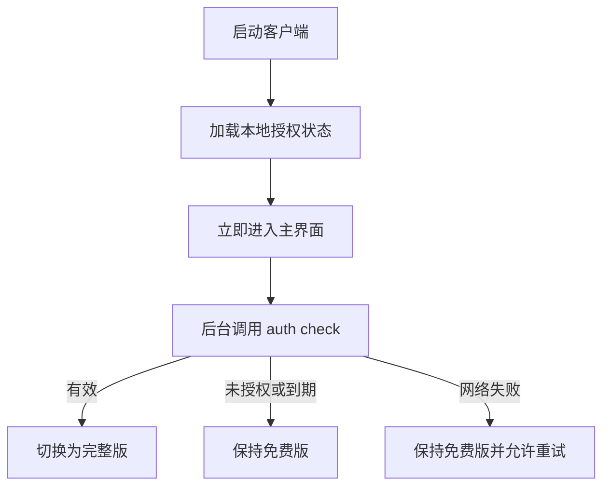
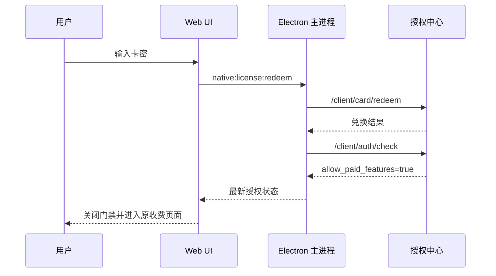

# 赤狐管家免费版与卡密完整版访问控制设计

> 状态：第二轮代码审计修订完成，待实施
> 版本：1.2
> 日期：2026-07-20
> 适用范围：`electron-client`、`remote-web/client-shell`、`kmsource`

## 1. 背景

赤狐管家当前采用设备码授权：卡密兑换到当前设备后，设备在授权有效期内可以使用软件。

当前客户端把授权判断放在应用入口和公共 IPC 通道上，结果是未授权设备无法进入任何业务模块。目标产品形态与此不同：

- 用户无需卡密即可进入软件并使用免费功能。
- 一张有效卡密开通当前设备上的全部收费功能，不按模块拆卡、不按模块分别续费。
- 商机中心和活动营销是当前明确的收费模块。
- 授权到期后回到免费版，免费数据和免费功能继续可用。

本文只设计“免费版 + 卡密完整版”两级访问控制，不设计多个套餐、模块包、点数计费或按店铺收费。

## 2. 设计结论

### 2.1 产品模型

客户端只有两个访问等级：

| 等级 | 内部标识 | 获得方式 | 可用范围 |
| --- | --- | --- | --- |
| 免费版 | `free` | 安装后默认获得 | 免费功能白名单 |
| 完整版 | `paid` | 当前设备兑换有效卡密 | 全站功能 |

卡密不携带模块列表。一张卡兑换成功后，只改变当前设备授权的有效期或永久状态；授权有效即为完整版，授权无效即为免费版。

### 2.2 免费与收费规则

免费功能采用显式白名单。当前免费模块如下：

| 一级模块 | 路由范围 | 访问等级 | 备注 |
| --- | --- | --- | --- |
| 店铺管理 | `/stores/**` | `free` | 包括店铺、经营数据、资金数据 |
| 预警/违规 | `/warnings/**` | `free` | 包括违规查询和处理 |
| 商品管理 | `/products/**` | `free` | 包括滞销清理、批量删除 |
| 系统能力 | `/system/**` | `free` | 诊断、日志、更新等非业务能力 |
| 商机中心 | `/opportunities/**` | `paid` | 商机提报、自动收藏、失效收藏清理 |
| 活动营销 | `/marketing/**` | `paid` | 限时限量购、新人礼金、通用优惠券 |

新增业务功能默认按 `paid` 处理。只有经过产品确认后，才能加入免费白名单。这样可以避免新增路由因为忘记配置而被意外免费开放。

### 2.3 不在本期范围内

- 不区分商机卡、营销卡或其他模块卡。
- 不新增套餐、权益明细和卡密适用模块字段。
- 不改变一张卡只能兑换一次、绑定当前设备的规则。
- 不改变卡密时长、永久卡、试用卡和续费叠加规则。
- 不兼容旧 Electron、旧远程 Web、旧 runner IPC 协议和旧本地业务数据，不提供迁移或回退分支。
- 不承诺抵抗修改 Electron 二进制或替换已校验发布资源的强逆向攻击，但必须阻止正常 UI、深链、后台任务、生产 DevTools 和普通页面脚本绕过访问控制。

## 3. 现状与差距

### 3.1 已具备能力

授权中心现有 `/client/auth/check` 已返回：

- `allow_free_features`
- `allow_paid_features`
- `auth_status`
- `expire_at`
- `remaining_seconds`
- `is_permanent`
- `need_redeem_or_renew`

授权中心管理端已有以下应用配置：

- `has_free_features = true`
- `expired_behavior = allow_free_features_only`
- `auth_object_type = device_code`

因此本设计不要求修改授权中心数据库结构，也不要求卡密增加权益字段。

### 3.2 当前客户端问题

1. `App.tsx` 使用全局 `licenseReady`，未授权时直接渲染全屏授权页，免费功能无法进入。
2. `ipc-guard.js` 对 HTTP、Cookie、文件和本地数据等公共 IPC 一刀切校验授权，免费功能即使能打开也无法完成业务操作。
3. `device-license.js` 能解析 `allowFreeFeatures`，但构建最终状态时没有稳定向渲染层透传。
4. 活动营销定时任务仅根据功能配置启动，没有把付费授权作为启动条件。
5. 商机和营销与免费模块共用任务运行器及基础 IPC，不能简单按 IPC 通道判断收费与否。
6. runner 当前接受 BroadcastChannel 的任意 `task:start`，且 preload 向主页面暴露通用 HTTP、Cookie、窗口执行和本地数据接口，单独增加页面门禁仍可被普通脚本绕过。
7. 当前 `CHIHU_LICENSE_BYPASS` 在打包环境也会生效，用户可以通过进程环境变量绕过生产授权。
8. runner 直接执行渲染层提交的 `payload.doudianAdapter`；只校验 `taskType` 时，普通脚本可以用免费任务类型携带伪造 adapter，借 runner 发起任意平台请求。
9. 批量删除、商机扫描/提报/收藏、自动收藏类目查询等真实流程没有全部经过现有任务运行器；直接收口主页面高风险 IPC 会同时造成付费旁路和免费功能回归。
10. 营销记录与其他远程功能记录共用 `remote_feature_records_v1`，免费和收费任务又共用 `operations`，仅按 `storeName` 无法完成数据权限判断。
11. 当前恢复和营销对账在主页面直接读取本地记录并调用平台请求；重启后 `RunnerContext` 丢失，若无独立恢复入口则无法同时满足“收口主页面能力”和“无授权也能完成对账”。
12. 主窗口和 runner 的身份目前只体现为 `webContentsId`，未绑定固定 release、主 frame 和导航代次；页面越界导航后仍可能保留同一 preload 和调用方 ID。

## 4. 核心访问模型

### 4.1 统一访问标识

路由和任务统一使用以下类型：

```ts
export type AccessTier = "free" | "paid";
```

路由定义增加必填字段：

```ts
export interface FeatureRouteDefinition {
  route: string;
  parentRoute: string;
  accessTier: AccessTier;
  // existing fields...
}
```

不允许 `accessTier` 缺省。路由审计测试应保证每个业务路由都显式声明访问等级。

### 4.2 客户端授权状态

`NativeLicenseStatus` 保留现有字段并补齐免费能力字段：

```ts
export interface NativeLicenseStatus {
  configured: boolean;
  bypass?: boolean;
  licensed: boolean;
  allowFreeFeatures: boolean;
  allowPaidFeatures: boolean;
  paidAccessGranted: boolean;
  authStatus?: string;
  expireAt?: string | null;
  remainingSeconds?: number;
  isPermanent?: boolean;
  needRedeemOrRenew?: boolean;
  lastCheckedAt?: string;
  paidAccessSource: "none" | "server" | "redeem" | "bypass";
  verificationPending: boolean;
  status?: string;
  reason?: string;
  message?: string;
}
```

字段语义：

- `licensed`：兼容展示字段，表示当前进程是否存在有效完整版访问权，与 `paidAccessGranted` 保持一致，不能直接从持久化授权结果恢复。
- `allowFreeFeatures`：授权中心应用配置是否允许免费功能，用于状态展示和诊断。
- `allowPaidFeatures`：最近一次服务端响应中的原始业务字段，可持久化用于展示和诊断，但不能直接作为本进程访问判断。
- `paidAccessGranted`：主进程根据当前进程内有效 lease 计算的最终访问字段，是渲染层唯一允许使用的付费判断依据。
- `bypass`：主进程确认当前为未打包开发/自动化环境后才可能为真；打包环境中必须恒为假。
- `paidAccessSource`：当前进程内付费 lease 的来源；只允许存在于内存状态，不能从本地文件恢复。
- `verificationPending`：卡密已兑换成功，但兑换后的授权刷新尚未成功。

主进程内部维护不可序列化、不可持久化的 lease：

```ts
type PaidAccessLease = {
  source: "server" | "redeem" | "bypass";
  grantedAtMonotonic: number;
  expiresAtMonotonic: number;
  verificationGeneration: number;
};
```

`PaidAccessLease` 不通过 IPC 原样发送，不写入 `device-license-state`。主进程每次生成状态时根据单调时钟计算 `paidAccessGranted`；lease 不存在或过期时，该字段必须为 `false`，即使持久化的 `allowPaidFeatures` 仍为 `true`。

客户端实际判断集中到一个纯函数，页面不得自行组合多个状态字段：

```ts
export function canAccessTier(status: NativeLicenseStatus, tier: AccessTier) {
  if (tier === "free") return true;
  return status.paidAccessGranted === true;
}
```

免费访问不依赖授权中心实时可用。授权接口返回 `APP_DISABLED`、授权配置缺失或网络错误时，本设计均只关闭收费功能，不关闭免费功能。强制更新不纳入本卡密方案；远程资源完整性校验失败继续由 Electron 现有加载流程直接展示错误页。

生产 bypass 是发布阻断条件：

```text
developmentBypass = !app.isPackaged
  AND CHIHU_EXPLICIT_TEST_MODE = "1"
  AND CHIHU_LICENSE_BYPASS = "1"
```

打包环境必须忽略 `CHIHU_LICENSE_BYPASS`、URL 查询参数和渲染层声明；不能只靠发布流程约定“不设置环境变量”。`internal` 任务与 bypass 使用同一个由主进程计算的未打包测试环境判定。

### 4.3 状态决策表

| 授权状态 | 免费功能 | 收费功能 | 用户体验 |
| --- | --- | --- | --- |
| 首次安装、未兑换 | 可用 | 不可用 | 显示免费版，收费入口带锁 |
| 正在检查授权 | 可用 | 暂不启动新任务 | 收费入口进入后显示检查状态 |
| 授权有效 | 可用 | 可用 | 显示完整版和到期时间 |
| 永久授权 | 可用 | 可用 | 显示永久完整版 |
| 授权到期 | 可用 | 不可用 | 收费页面提示续费 |
| 授权被封禁 | 可用 | 不可用 | 收费页面显示不可用及联系方式 |
| 授权服务未配置 | 可用 | 不可用 | 免费版可用，诊断显示配置异常 |
| 卡密兑换成功、授权刷新中 | 可用 | 当前进程内 redeem lease 最长 10 分钟可用 | 显示授权待刷新并继续后台刷新 |
| 新进程启动时网络失败 | 可用 | 不可用 | 本地状态只用于展示，收费页面允许重试 |
| 当前进程最近 10 分钟已在线校验成功 | 可用 | 可用 | 使用进程内短期授权 lease |
| 进程内短期 lease 过期且网络失败 | 可用 | 不可用 | 停止新收费任务，不影响免费功能和已启动任务 |
| 开发 bypass | 可用 | 可用 | 仅开发环境显示开发授权 |

## 5. 授权生命周期

### 5.1 启动流程

客户端启动时不再等待授权检查完成后才进入主界面。



启动要求：

1. 本地状态读取失败时按免费版启动。
2. 授权中心请求失败不得阻塞免费页面。
3. 本地保存的旧授权只用于展示设备号、上次到期时间和诊断信息，新进程必须成功调用一次 `/client/auth/check` 才能启动收费任务。
   - 读取本地状态后返回渲染层的 `paidAccessGranted`、`licensed` 必须为 `false`，`paidAccessSource` 必须为 `"none"`。
   - 持久化的 `allowPaidFeatures` 只能显示为“上次在线状态”，不得使收费组件挂载或执行副作用。
4. 授权检查完成后只更新访问状态，不重置当前免费页面。
5. 用户当前位于收费路由且授权失效时，保留路由并展示收费功能门禁，不跳回首页。

### 5.2 兑换与续费流程



兑换规则：

- 卡密只在提交时存在于内存，不写入本地状态，不进入日志。
- `/client/card/redeem` 成功本身是一次服务端有效确认。主进程根据其 `auth_status`、`remaining_seconds` 和 `is_permanent` 生成最长 10 分钟的进程内临时付费授权，并设置 `paidAccessSource="redeem"`、`verificationPending=true`。
- 兑换响应不得通过通用 `normalizeAuthPayload` 覆盖最后一次已验证授权，也不得把临时付费授权持久化为下次启动可用的授权。
- 兑换成功后必须立即执行一次授权刷新；成功后切换为 `paidAccessSource="server"`，失败时显示“兑换成功，授权状态待刷新”并保留重试入口。
- 兑换成功后的刷新不得复用兑换提交前已经开始的 `auth/check` Promise。主进程必须使用授权检查 generation：先使旧 generation 失效，再等待旧请求结束或发起新的 post-redeem 检查，旧响应不得覆盖 redeem lease。
- 临时付费授权到期前仍未刷新成功时停止新收费任务，但不重复兑换同一张卡。
- 从收费路由触发兑换时记录 `pendingPaidRoute`，成功后回到该路由。
- 从用户菜单续费时不改变当前路由。

### 5.3 到期处理

- 到期后免费功能继续可用。
- 本轮不设计旧版本数据迁移；新版本运行期内产生的数据不会因为授权到期被主动删除。
- 不允许创建新的收费任务。
- 已经开始的写任务允许自然完成或进入对账恢复，不因授权到期强制中断。
- 已经开始的只读任务也允许完成，完成后禁止再次启动。
- 收费模块的取消、状态查询、错误恢复和对账不受授权限制，避免留下无法收敛的中间状态。

## 6. 在线校验与进程内缓存策略

### 6.1 基本原则

- 服务端授权结果是最终依据。
- 免费功能永不依赖授权缓存。
- 本期不提供跨重启的付费离线能力，不读取或实现授权后台的 `allow_offline/offline_grace_days`。
- 每次启动后，收费功能必须至少成功在线校验一次。
- 成功校验或成功兑换后，可以使用当前进程已有的 10 分钟短期 lease，避免每个操作重复请求授权中心。
- 短期 lease 有效期不得超过服务端授权到期时间。
- 服务端明确返回未授权、到期、封禁或 `allow_paid_features=false` 时立即撤销现有 server lease；网络错误和超时不延长 lease，也不在 lease 自然到期前提前撤销最后一次已验证权限。
- redeem lease 只能被兑换后 generation 的明确服务端结果替换；兑换前请求、持久化状态和普通错误响应不能覆盖它。

当前进程短期 lease 计算：

```text
remainingFromServerMs = max(0, expireAt - adjustedServerNow)
leaseTtlMs = min(10min, remainingFromServerMs)
expiresAtMonotonic = monotonicNow + leaseTtlMs
```

不能直接把 ISO 墙上时间与 `performance.now()` 比较。`adjustedServerNow` 根据最近响应的 `serverTime` 和本进程内经过的单调时间计算；永久授权的 `leaseTtlMs` 固定上限同样为 10 分钟。lease 过期后再次启动收费任务时重新请求 `/client/auth/check`；请求失败则拒绝新任务，已经启动的任务按启动时授权快照继续完成。

### 6.2 本地状态要求

- 继续使用原子写入和完整性签名保存设备、上次授权结果及诊断信息，但持久化结果不直接授予新进程收费权限。
- 根据 `expireAt`、`serverTime` 和当前进程内保存的服务端时间偏移计算剩余时长，不能长期复用固定 `remainingSeconds`。
- 当前进程内使用单调时钟计算短期 lease TTL，降低系统时间回拨影响。
- 进程退出后清空内存授权；本地缓存损坏、签名不匹配或字段缺失时按“无付费授权”处理，免费功能继续可用。
- `paidAccessGranted`、`paidAccessSource`、`PaidAccessLease`、单调时钟值和 bypass 结果禁止写入本地文件；读取旧 `stateVersion` 时只允许删除或作为不授予权限的诊断输入。

## 7. 前端交互设计

### 7.1 导航

- 免费版仍显示商机中心和活动营销入口，不隐藏收费模块。
- 收费一级菜单或子菜单显示锁图标。
- 已授权后移除锁图标，不额外改变导航位置，避免布局跳动。
- 直接访问收费深链时必须走同一门禁，不允许出现空白页或静默跳转。

### 7.2 收费页面门禁

收费路由未授权时继续渲染应用外壳和导航，内容区渲染 `PaidFeatureGate`：

- 标题：`开通完整版`
- 状态：未开通、已到期、正在检查、网络异常或已封禁
- 操作：输入卡密、兑换、刷新授权
- 辅助信息：当前设备号、到期时间、客服联系方式

不再使用全屏 `LicenseGateScreen` 作为普通未授权状态。远程资源完整性错误由 Electron 现有错误页处理，不复用卡密门禁。

### 7.3 用户菜单

用户菜单展示当前版本状态：

- 未授权：`免费版`
- 有效期授权：`完整版 · 有效期至 YYYY-MM-DD`
- 永久授权：`永久完整版`
- 兑换待刷新：`完整版 · 授权待刷新`

“卡密续费”入口始终可用，免费版中改为“开通完整版”。

### 7.4 授权变化

- 兑换成功：立即解除当前收费页面门禁。
- 手动刷新后到期：当前收费页面切换为门禁状态。
- 后台检查发现到期：正在执行的任务保持可见并允许完成，新的操作按钮禁用。
- 网络恢复：自动刷新一次授权状态，但要做请求合并和频率限制。

## 8. 路由访问控制

### 8.1 路由声明

当前路由建议配置如下：

```ts
const featureRoutes = [
  { route: "/stores", accessTier: "free" },
  { route: "/stores/business-data", accessTier: "free" },
  { route: "/stores/funds", accessTier: "free" },
  { route: "/warnings", accessTier: "free" },
  { route: "/products/slow-moving", accessTier: "free" },
  { route: "/products/bulk-delete", accessTier: "free" },
  { route: "/opportunities/product-prematch", accessTier: "paid" },
  { route: "/opportunities/favorites", accessTier: "paid" },
  { route: "/opportunities/favorites/cleanup", accessTier: "paid" },
  { route: "/marketing/limited-time", accessTier: "paid" },
  { route: "/marketing/new-user-bonus", accessTier: "paid" },
  { route: "/marketing/coupons", accessTier: "paid" }
];
```

真实实现保留现有完整路由字段，不单独维护第二份业务路由权限表，避免路由和权限配置漂移。当前特殊路由 `/system/diagnostics` 不在 `featureRoutes` 中，必须通过受审计的 `SYSTEM_FREE_ROUTES` 显式声明为免费；未知特殊路由拒绝渲染，不能默认免费。

### 8.2 渲染规则

路由解析必须区分功能可用性与付费权限，按以下顺序得到唯一状态：

```text
配置或 adapter 尚未加载
  -> loading，保留原路由

路由不存在，或功能配置/adapter 明确禁用
  -> unavailable，显示不可用状态或跳转免费首页

路由可用且 accessTier=paid，但当前无付费权限
  -> locked，保留原路由并渲染 PaidFeatureGate

路由可用且权限满足
  -> active，渲染功能页面
```

不得再以 `activeDefinition` 暂时不存在为由立即跳转。只有配置和 adapter 都完成解析且状态确定为 `unavailable` 时才能跳转，确保活动营销深链在启动授权检查期间不会被误重定向。

路由门禁只负责体验，不能作为唯一业务权限边界。

## 9. 任务与 IPC 访问控制

### 9.1 任务分级

所有抖店任务类型必须在统一注册表中声明访问等级和能力范围：

```ts
type TaskAccessTier = AccessTier | "recovery" | "internal";

type TaskDefinition = {
  taskType: string;
  accessTier: TaskAccessTier;
  mutation: boolean;
  validateParams: (value: unknown) => ParsedTaskParams;
  isEnabled: (snapshot: VerifiedReleaseSnapshot, params: ParsedTaskParams) => boolean;
  allowedPlanKeys: readonly string[];
  allowedDataScopes: readonly DataAccessScope[];
};

type DataAccessScope = {
  commands: readonly string[];
  storeName?: string;
  recordIdPrefixes?: readonly string[];
  taskTypes?: readonly string[];
  actions: readonly ("read" | "write" | "delete" | "reconcile")[];
};
```

| 任务类型 | 等级 |
| --- | --- |
| `fetchDoudianStores` | `free` |
| `refreshDoudianStoreStatus` | `free` |
| `syncProductCatalog` | `free` |
| `businessData` | `free` |
| `fundsData` | `free` |
| `violationsData` | `free` |
| `staleGoodsScan` | `free` |
| `staleGoodsExecute` | `free` |
| `bulkDeleteScan` | `free` |
| `bulkDeleteExecute` | `free` |
| `opportunityReportScan`，模式限 `clue-scan/product-scan/product-prematch` | `paid` |
| `opportunityReportAction`，模式限 `clue-submit/product-submit/prematch-submit/collect` | `paid` |
| `opportunityFavoriteCategories` | `paid` |
| `opportunityPipelineSubmit` | `paid` |
| `opportunityAutoFavorites` | `paid` |
| `opportunityFavoritesClearInvalid` | `paid` |
| `marketingTask` | `paid` |
| `marketingReconcile` | `recovery` |
| `mockLongTask` | `internal` |

该表是根据当前真实调用点得到的最低清单，不是允许遗漏的示例。实施时必须静态审计 `fetchBulkDeleteProducts`、`fetchOpportunityReport`、`fetchOpportunityFavoriteCategories` 和所有 `runDoudianRequestPlan` 调用点：生产构建中，主页面不得直接执行平台请求计划；所有需要 HTTP、Cookie、签名或隐藏平台窗口的流程都必须映射到任务或参数受限的明确主进程命令。商机历史、候选项、pipeline summary、营销运行记录等不需要平台请求的本地读取不必创建 runner，但必须作为 `DataAccessScope` 中显式的 `paid` 数据命令，不能因为“只是本地读取”而免费放行。

未知任务类型在生产环境拒绝启动。`recovery` 不能由普通 `startRunner` 请求创建，只能由主进程根据持久化的待收敛 operation 生成。`internal` 任务只允许在主进程确认的未打包显式测试环境运行，防止新增收费功能因为漏配而默认免费。

### 9.2 主进程任务边界

本轮不保留旧 runner 协议。所有免费和收费任务统一改走主进程任务通道：

```ts
type StartRunnerRequest = {
  taskType: string;
  clientRequestId?: string;
  params: Record<string, unknown>;
};

type StartRunnerResult =
  | { ok: true; operationId: string; status: "started" | "deduplicated" }
  | { ok: false; code: "LICENSE_REQUIRED" | "AUTH_EXPIRED" | "AUTH_CHECK_FAILED" | "TASK_TYPE_DENIED" | "TASK_PARAMS_INVALID"; message: string };
```

`operationId` 由主进程生成。去重键、`mutation`、adapter 版本、rule 版本和能力范围由主进程注册表或 runner 加载的已验证 release 决定，不能相信渲染层字段。

`params` 是按任务分别校验的最小业务参数，只允许店铺 ID、记录 ID、日期、分页、过滤条件和受控 action 枚举。以下字段不得由渲染层提交：

- 完整 `doudianAdapter`、功能配置、请求计划或脚本内容。
- URL、origin、HTTP method、headers、Cookie、partition 或任意 JavaScript。
- `mutation`、`accessTier`、`allowedPlanKeys`、`adapterVersion`、`ruleVersion` 和授权快照。

主进程从固定 release 加载并校验 adapter/config，创建不可变 `VerifiedReleaseSnapshot`；runner 只接收 snapshot ID 和业务映射所需的只读副本。所有特权 transport 仍由主进程根据自己持有的 snapshot 解析 planKey、URL、method 和能力范围，不能相信 runner 回传的解析结果。只比较渲染层提交的版本号或 hash 不构成可信校验。

启动流程：

1. 渲染层根据公开任务目录做第一次检查，仅用于及时展示门禁。
2. 渲染层调用 `native:tasks:startRunner`，不再自行调用 `native:windows:open/eval` 创建 runner。
3. 主进程按自身任务注册表解析 `taskType`、校验对应 `params` schema，并根据已验证 snapshot 再次检查功能配置和 adapter capability 后生成 `operationId`；主进程注册表是最终依据。
4. `paid` 任务调用 `requirePaidFeature`；`free` 任务直接放行；`recovery` 拒绝普通启动；`internal` 只在主进程确认的未打包显式测试环境放行。
5. 主进程创建 runner 后记录 `RunnerContext`，通过主进程私有事件发送 snapshot ID、只读业务映射和已经解析的最小业务参数。
6. runner 请求平台能力时只提交 `operationId + planKey + context` 等结构化命令；主进程核对发送者、任务声明和允许的 planKey/数据范围后执行。runner 不获得任意 HTTP、Cookie、URL 或 eval 接口。
7. runner 的进度、结果和错误先发回主进程，由主进程核对发送者、导航代次和 `operationId` 后持久化并转发给所属主窗口。
8. 取消任务调用 `native:tasks:cancelRunner`，由主进程核对 operation 后转发给对应 runner；取消不能创建新业务请求。

```ts
type RunnerContext = {
  runnerWebContentsId: number;
  ownerWebContentsId: number;
  operationId: string;
  taskType: string;
  accessTier: TaskAccessTier;
  paidGrantedAtStart: boolean;
  principalNavigationEpoch: number;
  adapterSnapshotHash: string;
  allowedPlanKeys: Set<string>;
  allowedDataScopes: DataAccessScope[];
  childWindowIds: Set<number>;
};
```

当前任务一旦由主进程批准，`paidGrantedAtStart` 在该任务生命周期内保持有效，使已经开始的写任务可以自然完成。它不能被其他任务或窗口复用。主进程必须限制单任务最大存活时间、并发数和无心跳回收；授权快照不允许通过无限挂起的 runner 长期保留。

### 9.3 阻断现有脚本旁路

必须同时完成以下改造，否则 `native:tasks:startRunner` 不是有效权限边界：

- 删除 runner 对 BroadcastChannel `task:start` 和 `task:cancel` 的监听。BroadcastChannel 不再承担任务控制和结果可信传输。
- 禁止通用 `openWindow`、`native:windows:open` 创建带 `runner=1` 的当前应用页面。
- 禁止主页面通过通用 `native:windows:eval` 向 runner 注入代码。
- runner 只能操作自己在 `RunnerContext.childWindowIds` 中登记的平台子窗口，不能操作其他 runner 或主窗口。
- 生产打包环境关闭 `Ctrl+Shift+N` DevTools 快捷键；仅 `!app.isPackaged` 且显式开发配置开启时保留。
- runner 不再直接调用 `native:http:request`、通用 Cookie 和任意窗口 eval；`requestPlan` 的底层 transport 改为主进程按当前 `RunnerContext.allowedPlanKeys` 执行的结构化命令，业务任务函数本身保持不变。

每个受信页面都必须绑定主进程创建的 principal：

```ts
type WebContentsPrincipal = {
  role: "main" | "runner" | "platform-child";
  webContentsId: number;
  ownerOperationId?: string;
  releaseId?: string;
  expectedOrigin: string;
  expectedPathPrefix: string;
  navigationEpoch: number;
};
```

- 所有特权 IPC 同时核对 `event.sender`、主 frame、当前 URL、principal role 和 `navigationEpoch`，不能只核对 `webContentsId`。
- 主窗口和 runner 禁止导航到固定 release 之外的 origin/path；跨文档导航、重定向或 frame 不匹配时立即撤销 principal。runner principal 失效时销毁其 `RunnerContext` 并把写任务转入待对账。
- 平台子窗口只允许导航到任务声明的受控平台 origin；它只能作为 runner 命令的目标，不得作为 `startRunner`、HTTP、Cookie 或数据命令的调用方。
- `setWindowOpenHandler`、`will-navigate`、`will-redirect` 和每次 IPC 的 sender-frame 校验必须同时存在，单靠页面路由或初次完整性检查不够。

preload 和 IPC 按发送方分层放行：

| 调用方 | 允许能力 | 规则 |
| --- | --- | --- |
| 主页面 | 授权、页面所需受控本地数据、文件导入导出、通知、更新、任务启动/取消/状态/恢复命令 | 不允许任意 Doudian HTTP、Cookie 读取或任意窗口 eval |
| 主页面免费店铺操作 | `native:platform:openVisible`、`native:stores:clearPartition` 等明确命令 | 保留店铺登录、打开平台页和删除店铺清理功能 |
| 已注册 runner | 执行声明过的 request plan、创建/执行/销毁所属平台子窗口、访问声明过的数据范围 | 主进程按 `RunnerContext`、planKey、数据范围和所属子窗口校验，不暴露任意 HTTP/Cookie/eval |
| 恢复 runner | 读取待收敛 operation 证据并执行声明过的只读对账 plan | 不能执行新 mutation，不能扩展原任务数据范围 |
| 未注册子窗口或普通页面脚本 | 无任务级高风险能力 | 拒绝并记录脱敏错误码 |

本地数据继续支持正常页面读取，但不能只按 `storeName` 判权。商机和营销专用 storeName 仍需检查付费授权；对于混合的 `remote_feature_records_v1` 和 `operations`，必须按受审计的记录类型、ID 前缀、`taskType`、operation 所有权和 action 组合判断。页面不得传入任意前缀扩大查询范围。完整 `DataAccessScope` 从 repository 常量、营销记录前缀和 operation 任务注册表生成契约测试，不在 IPC handler 中临时猜测字符串。

主进程不能根据当前页面 hash 判断权限，因为后台计划任务、隐藏任务窗口和任务恢复都可能在用户不位于对应路由时运行。

### 9.4 恢复、取消与对账能力

取消、状态查询和对账不等于重新授予完整付费权限：

1. 主进程在首次批准 mutation 任务时，把 `taskType`、`paidGrantedAtStart`、adapter snapshot hash、允许的恢复 planKey 和数据范围写入 operation 证据；不保存通用能力 token。
2. 进程重启后，`native:tasks:recover` 只接受已有 operationId。主进程必须确认该记录确实由过去已授权任务产生，且处于 `cancelling/interrupted/reconciling` 等可恢复状态。
3. 主进程为其创建 `accessTier="recovery"` 的新 `RunnerContext`，只允许读取该 operation 的尝试记录、执行注册表声明的只读查询计划并写回对账结果。
4. recovery runner 禁止任何新 mutation、创建新营销计划、扩大店铺范围或复用到其他 operation。缺少原 adapter snapshot 时转人工对账，不能回退到当前任意 adapter。
5. 取消活跃 runner 时沿用已有上下文；runner 已丢失时只更新为中断/待对账，不伪造“已取消成功”。

### 9.5 正常功能不变原则

安全改造只替换任务编排和桥接入口，不修改 `runFetchDoudianStoresTask`、`fetchBusinessData`、`fetchFundsData`、`fetchViolationsData`、`fetchStaleGoodsCleanup`、商机和营销等业务任务实现。

必须保持：

- 原分区、Cookie、签名、HTTP 请求、平台子窗口和本地数据库逻辑不变。
- 免费店铺登录、店铺删除清理、打开违规处理页、文件导入导出正常。
- 已授权商机与营销的读取、写入、取消、恢复和对账正常。
- 收费任务执行中授权过期时不中断该任务，只拒绝新任务。

如果使用清单发现某个正常免费流程仍需高风险通用 IPC，应为该流程增加参数受限的明确 IPC，不得直接删除该功能，也不得重新放开任意 HTTP 或任意 eval。

渲染层和主进程任务注册表通过自动化审计保持一致，主进程校验结果优先。

### 9.6 后台任务

活动营销调度循环可以在免费版中运行，以便识别并标记延期计划；真正创建营销 runner 必须满足以下条件：

```text
feature config enabled
AND adapter capability enabled
AND paidAccessGranted = true
```

授权失效时：

- 停止创建新的营销 runner。
- 不删除原计划。
- 将已到期计划标记为 `deferred`，不计为业务失败。
- 授权恢复后重新计算下一次执行时间，不能集中补跑所有过期计划。

现有 `MarketingScheduleExecutionResult` 只有 `ok`，无法表达“不执行也不失败”。必须改为显式结果：

```ts
type MarketingScheduleExecutionResult =
  | { outcome: "executed"; ok: boolean; operationId?: string; entityId?: string; nextRunAt?: string }
  | { outcome: "deferred"; reason: "license_required" | "auth_check_failed" };
```

`MarketingScheduleStatus` 增加 `deferred`。`deferred` 必须释放 schedule claim，保留业务配置、原 `nextRunAt` 和 `failureCount`，记录 `deferredReason/deferredAt`，不写成 `failed`，且 `marketingScheduleDue` 不再把它视为到期可执行。任务启动竞态中由主进程返回的授权拒绝也必须转换为 `deferred`，不能落为普通业务失败。

授权恢复时单独执行一次 rebase：把所有仍启用的 `deferred` 计划恢复为 `active`，并按 `nextMarketingScheduleTime(schedule, recoveryNow)` 计算新的 `nextRunAt`，清除延期字段。不得按旧 `nextRunAt` 立即补跑，也不得为每个错过周期生成执行记录。

## 10. 授权中心配置

本设计不修改 `kmsource` 代码和客户端授权协议，只确认目标应用配置：

| 配置 | 目标值 |
| --- | --- |
| 授权对象 | `device_code` |
| 包含免费功能 | `true` |
| 到期后策略 | `allow_free_features_only` |
| 允许离线使用 | `false` |
| 离线宽限天数 | `0` |
| 最大设备数 | 按现有产品规则 |
| 卡密规格 | 沿用现有时长、试用和永久规格 |

`/client/auth/check` 的期望结果：

| 场景 | `allow_free_features` | `allow_paid_features` |
| --- | --- | --- |
| 未兑换 | `true` | `false` |
| 授权有效 | `true` | `true` |
| 授权到期 | `true` | `false` |
| 授权封禁 | `true` | `false` 或返回对应封禁错误 |

客户端不得根据卡密规格名判断访问范围，也不得在本地维护“某种卡开某个模块”的映射。

后台现有 `allow_offline/offline_grace_days` 不在本期客户端实现范围内。将目标应用配置为不允许离线，可以保证客户端“不跨重启授予付费权限”的行为与后台配置一致。

## 11. 错误与边界策略

| 场景 | 处理 |
| --- | --- |
| 授权接口超时 | 免费功能继续；当前进程短期 lease 有效时可启动收费任务，否则显示重试 |
| 授权配置缺失 | 免费功能继续；收费入口显示服务暂不可用；诊断页记录配置问题 |
| 本地授权文件损坏 | 清除无效缓存并按免费版启动 |
| 卡密为空 | 前端阻止提交，主进程再次校验 |
| 卡密无效、已使用或作废 | 展示稳定错误文案，不泄漏后台细节 |
| 卡密兑换成功、刷新失败 | 使用最长 10 分钟的进程内临时 lease 并持续允许刷新，不持久化为下次启动权限，不重复兑换同一张卡 |
| 授权在写任务中途到期 | 当前任务完成或进入对账；禁止新任务 |
| 收费深链未授权 | 保留深链，内容区展示门禁 |
| 免费功能调用共享 IPC | 必须放行，不触发卡密弹窗 |
| 收费任务伪装为未知任务 | 生产环境拒绝启动并记录脱敏诊断 |
| 免费任务携带 adapter、URL 或任意配置 | 主进程 schema 校验拒绝；只使用已验证 release snapshot |
| 打包环境设置 `CHIHU_LICENSE_BYPASS=1` | 忽略环境变量，保持无付费权限并记录配置告警 |
| 主窗口或 runner 越界导航 | 阻止导航并撤销 principal；写任务进入待对账 |
| 重启后恢复收费写任务 | 只创建受限 recovery runner，不要求当前付费授权，也不允许新 mutation |
| 混合数据 store 的越权前缀查询 | 按 `DataAccessScope` 拒绝，不能只校验 storeName |

日志不得包含完整卡密、应用密钥、Cookie、设备指纹原文或授权响应原文。允许记录错误码、短设备号、任务类型、路由和 `requestId`。

## 12. 破坏性发布与新数据空间

本轮明确不做兼容发布：

- 不支持新 Electron 加载旧远程 Web。
- 不支持旧 Electron 加载新远程 Web。
- 不保留旧 `openWindow/eval + BroadcastChannel` runner 启动协议。
- 不保留 `global` 授权模式、`featureAccessV1` 协商或双分支回退开关。
- 不迁移旧授权缓存、旧 operation、旧营销计划、旧商机状态和旧业务数据库。

发布采用一个破坏性版本：

1. 为该版本生成固定的远程 Web release URL、签名完整性清单和不可变 adapter/config snapshot，不继续复用可能被旧客户端加载的 `current` 内容。
2. Electron 先把清单内资源下载到按 releaseId 隔离的只读缓存并完成签名/hash 校验，再从该缓存或受控自定义协议加载主页面和 runner；禁止“校验一次网络响应后再让 Chromium 重新下载同一 URL”的 verify-then-refetch 流程。
3. 新版本使用新的 `userData` 数据 epoch 或全新的测试/正式用户数据目录；旧数据目录不作为输入，不执行迁移脚本。
4. `device-license-state` 提升状态版本，旧状态只允许删除或忽略，不转换成新进程付费权限。
5. 主窗口和 runner principal 固定到已验证 releaseId、origin/path 和导航代次；固定 URL 本身不能替代运行期 sender-frame 校验。
6. 发布前清空验收环境，重新同步设备、重新导入店铺并使用新卡密数据完成验收。

旧版本和旧数据不在发布门槛内。新版本上线后产生的数据按新模型正常保存，授权到期不会主动删除这些新数据。

## 13. 实施拆分

### 阶段一：状态契约

- 补齐 `allowFreeFeatures` 的本地保存、主进程状态和 TypeScript 类型。
- 增加 `paidAccessGranted`，统一 `canAccessTier` 只读取该字段。
- 增加不持久化的 `PaidAccessLease`、`paidAccessSource`、`verificationPending` 和进程内 10 分钟 lease。
- 禁止持久化授权直接放行新进程收费任务。
- 打包环境无条件禁用 bypass；未打包环境仍要求显式测试模式与环境变量同时开启。
- 为授权检查增加 generation，兑换后的检查不得复用或被兑换前请求覆盖。

### 阶段二：路由和交互

- 为所有路由增加必填 `accessTier`。
- 为 `/system/diagnostics` 增加受审计的特殊免费路由声明。
- 实现 `loading/unavailable/locked/active` 路由状态，修正收费深链重定向顺序。
- 移除普通未授权状态下的全屏门禁。
- 新增或改造 `PaidFeatureGate`。
- 导航增加稳定尺寸的锁状态。
- 兑换后恢复目标路由。

### 阶段三：任务和 IPC

- 根据所有真实调用点建立唯一任务分级、参数 schema 和能力注册表，补齐批量删除、商机扫描/动作、类目读取和恢复任务。
- 新增 `native:tasks:startRunner/cancelRunner/recover`、主进程生成的 operationId 和 `RunnerContext` 注册表。
- 删除 runner 的 BroadcastChannel 控制入口和旧 `openWindow/eval` 启动路径。
- 禁止任务请求携带 adapter/config/URL/method/headers/partition/任意脚本；主进程加载已验证 snapshot 并按 planKey 执行特权 transport。
- 建立 `WebContentsPrincipal`，按 role、主 frame、release/origin/path 和导航代次校验所有特权 IPC。
- 按 `DataAccessScope` 收口 HTTP、Cookie、窗口 eval 和混合本地数据访问，为正常免费流程补充参数受限的明确 IPC。
- 对计划任务、任务恢复和对账应用本文规则，增加受限 recovery runner、`deferred` 状态和授权恢复 rebase。
- 生产包关闭 DevTools 快捷键并忽略所有授权 bypass 环境变量。

### 阶段四：配置和发布

- 在授权中心确认免费功能和到期策略配置。
- 确认 `allow_offline=false`、`offline_grace_days=0`。
- 创建固定远程 Web release、已验证只读资源缓存、不可变 adapter snapshot 和新的本地数据 epoch。
- Electron、远程 Web、preload 和主进程 IPC 作为一个破坏性版本统一验收发布。
- 完成授权、免费功能和收费任务回归。

## 14. 测试与验收

### 14.1 自动化测试

必须新增：

- 路由访问等级完整性测试：所有路由都显式声明等级。
- 免费白名单测试：当前四组免费范围保持免费。
- 收费路由测试：所有 `/opportunities/**` 和 `/marketing/**` 均为收费。
- 授权状态标准化测试：`allowFreeFeatures`、`allowPaidFeatures` 不丢失，`paidAccessGranted/paidAccessSource/verificationPending` 始终显式返回。
- 状态决策表单元测试：持久化 `allowPaidFeatures=true` 但无进程 lease 时，`paidAccessGranted/ licensed` 必须为 false。
- 打包模式 bypass 测试：即使设置 `CHIHU_LICENSE_BYPASS=1` 也不能获得付费权限；未打包测试必须同时满足显式测试模式。
- 兑换检查竞态测试：兑换前启动的 auth/check 结果不能覆盖 redeem lease 或兑换后结果。
- 任务注册表完整性测试：所有实际平台请求调用点都有等级、参数 schema、planKey 和数据范围；生产主页面不得直接调用 `runDoudianRequestPlan`。
- 批量删除、商机扫描/动作、商机类目读取均通过新任务入口执行。
- 主进程拒绝在免费任务 params 中提交 adapter、config、URL、method、headers、partition、mutation 或任意脚本。
- 主进程生成 operationId，拒绝调用方伪造 operation 归属、跨任务取消和结果注入。
- 免费任务在无授权环境下可以启动。
- 收费任务在无授权、到期、进程内 lease 过期和新进程网络失败环境下被拒绝。
- 收费任务在有效授权、永久授权和当前进程短期 lease 有效环境下可以启动。
- 重启后即使存在旧的有效授权文件，也必须先在线校验才能启动收费任务。
- BroadcastChannel 伪造的 `task:start` 不能启动任何任务。
- 主页面不能通过通用 `openWindow/eval` 创建或控制 runner。
- 已注册 runner 也只能执行当前任务声明的 planKey 和数据范围，不能调用任意 HTTP、Cookie 读取和窗口 eval。
- 未注册窗口、平台子窗口、非主 frame 和越界导航后的旧 principal 不能调用任务级能力。
- runner 导航离开固定 release 后上下文被撤销，写任务进入待对账。
- 混合 `remote_feature_records_v1` 和 `operations` 的前缀、taskType、action 越权测试。
- 免费店铺登录、平台页跳转、Cookie 清理、文件和数据库能力回归通过。
- 授权到期不阻止任务取消、状态查询和受限恢复；recovery runner 不能执行新 mutation。
- 未授权时营销计划结果为 `deferred` 且不增加 `failureCount`；授权恢复后 rebase，不立即补跑旧周期。
- 完整性测试保证主窗口和 runner 实际加载的字节就是签名/hash 已验证的缓存字节，而不是重新下载的响应。

### 14.2 端到端验收

| 编号 | 前置条件 | 操作 | 期望结果 |
| --- | --- | --- | --- |
| A1 | 全新设备、无卡密 | 启动软件 | 进入免费版主界面 |
| A2 | 全新设备、无卡密 | 使用店铺、违规、商品模块 | 查询和写操作正常 |
| A3 | 全新设备、无卡密 | 点击商机中心 | 显示完整版门禁，不离开应用外壳 |
| A4 | 全新设备、无卡密 | 直接打开营销深链 | 显示同一门禁 |
| A5 | 无授权 | 兑换有效卡密 | 商机和营销同时开通 |
| A6 | 本地留有上次有效授权 | 重启软件并断开授权中心 | 免费功能可用，收费功能要求联网校验 |
| A7 | 授权到期 | 重启软件 | 免费功能可用，收费功能要求续费 |
| A8 | 收费写任务运行中 | 模拟授权到期 | 当前任务收敛，新任务被拒绝 |
| A9 | 无授权 | 等待营销计划触发 | 不启动任务，不破坏计划 |
| A10 | 兑换续费卡 | 刷新授权 | 到期时间延长，当前页面不重置 |
| A11 | 授权中心异常 | 启动软件 | 免费功能不受影响，收费新任务不启动 |
| A12 | 无授权 | 运行免费店铺登录、查询、写入和平台跳转 | 正常功能不因 IPC 收口受影响 |
| A13 | 无授权 | 从 DevTools 或普通页面脚本伪造 runner、BroadcastChannel 或高风险 IPC 调用 | 主进程拒绝，收费任务不执行 |
| A14 | 新版本、全新数据目录 | 首次启动 | 不读取、不迁移旧授权与旧业务数据 |
| A15 | 生产打包版本、无授权 | 设置 `CHIHU_LICENSE_BYPASS=1` 后启动 | 仍为免费版，收费任务被拒绝 |
| A16 | 无授权 | 伪造免费 taskType 并提交自定义 adapter/URL/method | 主进程以 `TASK_PARAMS_INVALID` 拒绝，未产生平台请求 |
| A17 | 无授权 | 执行批量删除扫描/执行 | 通过受控免费任务正常完成，不依赖主页面通用 HTTP/eval |
| A18 | 已授权 | 执行商机扫描、提交、收藏和类目读取 | 全部经过主进程任务边界；到期后不能重新启动 |
| A19 | 收费写任务产生待对账状态后重启并到期 | 启动恢复 | 仅执行原 operation 的只读对账，不要求续费、不产生新写请求 |
| A20 | 营销计划在无授权期间多次过期 | 恢复授权 | 计划按恢复时间重新排期，不集中补跑过期周期 |
| A21 | 主窗口或 runner 已建立 principal | 导航或重定向到固定 release 外页面后调用 IPC | 导航被阻止或 principal 被撤销，特权 IPC 被拒绝 |

### 14.3 发布门槛

以下条件全部满足才可默认启用 `freemium`：

- 免费模块在无卡密环境下通过完整回归。
- 收费任务在路由、深链、后台计划和任务入口均无法无授权启动。
- 生产包无法使用调试快捷键或 bypass 环境变量获得权限；普通脚本不能通过伪造 payload、runner、BroadcastChannel、导航复用或通用高风险 IPC 绕过授权。
- 卡密兑换一次同时开通商机中心和活动营销。
- 授权到期不阻断免费模块，不中断已经获得授权快照的运行中任务。
- 免费店铺、违规、商品和系统流程在 IPC 收口后与改造前行为一致。
- 批量删除和全部商机网络动作已纳入任务清单；注册表与真实调用点审计无遗漏。
- 待对账写任务可在授权到期或重启后通过 recovery runner 收敛，且无法产生新的收费 mutation。
- 营销延期计划在授权恢复后重新排期，不集中补跑。
- 主窗口和 runner 实际加载已验证缓存字节，并在运行期持续校验 principal 和导航边界。
- 新版本仅在全新数据 epoch 上验收，不执行任何旧版本兼容或数据迁移逻辑。
- 日志审计确认不记录完整卡密和敏感凭据。

## 15. 预估改动范围

主要涉及：

- `remote-web/client-shell/src/App.tsx`
- `remote-web/client-shell/src/featureRoutes.tsx`
- `remote-web/client-shell/src/bridge/license.ts`
- `remote-web/client-shell/src/components/LicenseGate.tsx`
- `remote-web/client-shell/src/components/ShellHeader.tsx`
- `remote-web/client-shell/src/domain/doudian/taskClient.ts`
- `remote-web/client-shell/src/domain/doudian/taskRunner.ts`
- `remote-web/client-shell/src/domain/doudian/requestPlan.ts`
- `remote-web/client-shell/src/bridge/doudianAdapter.ts`
- `remote-web/client-shell/src/domain/doudian/bulkDelete.ts`
- `remote-web/client-shell/src/domain/doudian/opportunityReport.ts`
- `remote-web/client-shell/src/domain/doudian/opportunityAutoFavorites.ts`
- `remote-web/client-shell/src/domain/doudian/marketing/reconcile.ts`
- `remote-web/client-shell/src/domain/doudian/marketing/scheduler.ts`
- `electron-client/src/main/license/device-license.js`
- `electron-client/src/main/license/ipc-guard.js`
- `electron-client/src/main/ipc/windows.js`
- `electron-client/src/main/ipc/business-database.js`
- 新增的 Electron 任务 runner IPC 模块
- `electron-client/src/main/index.js`
- `electron-client/src/main/security/remote-web-integrity.js`
- `electron-client/src/main/window/scheme-blocker.js`
- `electron-client/src/main/config.js`
- `electron-client/src/main/database` 下的数据 epoch 与清理入口
- `electron-client/src/main/utils/dev-shortcuts.js`
- `electron-client/src/preload/index.js`
- Electron 与 client-shell 对应测试文件

授权中心只做应用配置确认和联调，不修改 `kmsource` 代码，不做数据库迁移。

## 16. 最终验收口径

本设计完成后的用户认知应当非常简单：

> 赤狐管家安装即可使用免费功能；在当前设备兑换一张有效卡密后，即可在授权期内使用全部功能。授权到期后，软件自动回到免费版。新版本使用全新数据空间，不迁移旧版本数据。

技术验收也使用同一条规则：免费功能通过明确、参数受限的主进程能力正常运行；任何新收费业务动作必须在统一任务入口由主进程校验当前设备的完整版授权。渲染层不能提交 adapter、请求计划或任意高风险参数，runner 只能使用当前任务声明的能力，重启恢复只能收敛已有 operation，普通页面脚本不能直接取得任务级高风险能力。

## 17. 审计修订决议

本版本根据两轮实际代码审计，对以下问题作出最终决议：

| 审计项 | 决议 |
| --- | --- |
| 普通脚本可绕过任务门禁 | 使用主进程 `RunnerContext`、私有任务事件和按 principal 分层的高风险 IPC；删除 BroadcastChannel 控制入口。业务任务内部实现保持不变。 |
| 免费任务携带伪造 adapter 可取得任意能力 | 任务请求只接受按类型校验的最小业务参数；主进程持有已验证 release snapshot，按任务声明解析 planKey 和执行特权 transport。 |
| 真实任务清单遗漏批量删除和商机直调流程 | 把批量删除、商机扫描/动作、类目读取纳入任务注册表，并以所有 `runDoudianRequestPlan` 调用点的静态审计作为完整性门槛。 |
| 本地 `allowPaidFeatures=true` 会在新进程短暂解锁 | 服务端观察值与本进程访问权分离；`canAccessTier` 只读取不可持久化 lease 计算出的 `paidAccessGranted`。 |
| 生产包环境变量可开启 bypass | 打包环境恒定禁用 bypass；未打包环境也必须同时具备显式测试模式和环境变量。 |
| `webContentsId` 可在越界导航后复用 | 引入带 role、主 frame、固定 release/origin/path 和导航代次的 `WebContentsPrincipal`，越界导航立即撤销上下文。 |
| 重启后对账与主页面 IPC 收口冲突 | 根据持久化 operation 证据创建只读、范围受限的 recovery runner；允许收敛旧写任务，但禁止新 mutation。 |
| 混合 store 无法只按 storeName 判权 | 使用包含 recordId 前缀、taskType、operation owner 和 action 的 `DataAccessScope`；禁止页面提交任意查询前缀。 |
| 营销延期后会集中补跑 | 增加 `deferred` 状态；授权恢复时以恢复时间 rebase `nextRunAt`，不按旧到期时间补跑。 |
| 完整性校验后 Chromium 重新下载存在时间窗口 | 资源先下载到 releaseId 隔离的只读缓存并完成签名/hash 校验，主窗口和 runner 直接加载同一份已验证字节。 |
| 新旧版本兼容冲突 | 不做任何新旧 Electron、远程 Web 或 runner 协议兼容，使用固定远程 release 一次性发布。 |
| 离线策略与后台配置冲突 | 不改 `kmsource`，目标应用设为不允许离线；新进程必须在线校验，只有当前进程 10 分钟短期 lease。 |
| 授权拒绝被记为业务失败 | `startRunner` 返回结构化授权错误，营销调度增加 `deferred`，不增加失败次数。 |
| 应用停用和强制更新缺少模型 | 从本卡密方案移除全站停用和强制更新；相关授权错误只关闭收费功能，完整性错误继续走现有 Electron 错误页。 |
| 收费深链被可用性过滤误跳转 | 路由改为 `loading/unavailable/locked/active` 四态，只有明确 unavailable 才允许跳转。 |
| 兑换成功但刷新失败状态不完整 | 兑换成功生成最长 10 分钟、仅当前进程有效的临时付费 lease；授权检查使用 generation，兑换前响应不能覆盖兑换后状态，也不作为重启后的付费依据。 |

上述安全收口以“不改变正常业务能力”为硬约束。任何被高风险 IPC 收口影响的免费正常流程，都必须迁移为参数受限的明确 IPC 并完成回归，不允许以删除功能作为解决方案。
